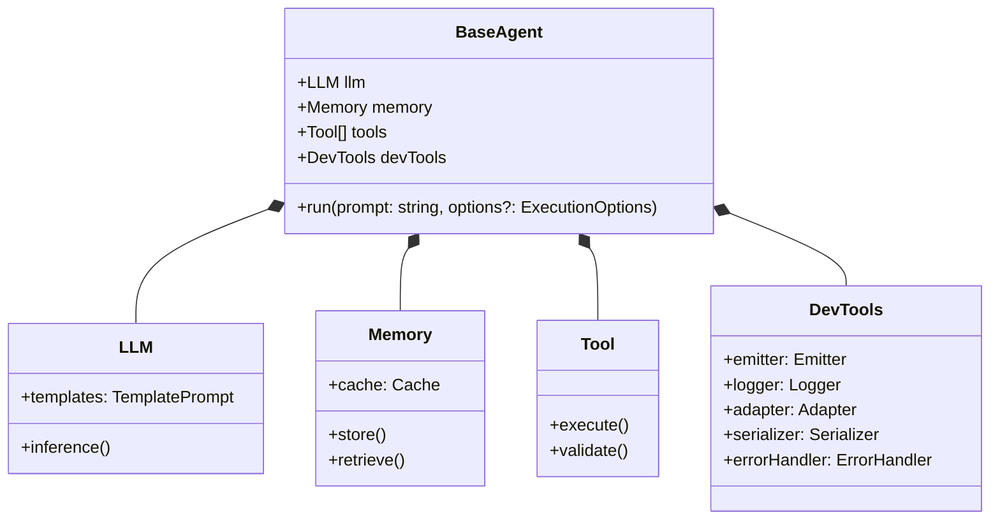

# Agent

The `BaseAgent` class is the foundation of the Bee Framework, providing the core interface and functionality that all agent implementations must follow. It orchestrates the interaction between LLMs, tools, memory, and development utilities to create intelligent, automated workflows.

## Overview

`BaseAgent` acts as an abstract base class that defines the standard interface and basic functionality for all agents in the framework. It manages the lifecycle of agent operations, coordinates between different components, and provides a consistent interface for agent implementations.

## Architecture



> [!TIP]
>
> Location within the framework `bee-agent-framework/agents`.

## Core Properties

| Property   | Type       | Description                                  |
| ---------- | ---------- | -------------------------------------------- |
| `llm`      | `LLM`      | Manages interactions with the language model |
| `memory`   | `Memory`   | Handles state management and persistence     |
| `tools`    | `Tool[]`   | Array of available tools for the agent       |
| `devTools` | `DevTools` | Development and debugging utilities          |

## Main Methods

### Public Methods

#### `run(prompt: string, options?: ExecutionOptions): Promise<AgentResponse>`

Executes the agent with the given prompt and options.

```typescript
interface ExecutionOptions {
  signal?: AbortSignal;
  execution?: {
    maxRetriesPerStep?: number;
    totalMaxRetries?: number;
    maxIterations?: number;
  };
}

const response = await agent.run("What's the weather in Las Vegas?", {
  signal: AbortSignal.timeout(60000),
  execution: {
    maxIterations: 20,
    maxRetriesPerStep: 3,
    totalMaxRetries: 10,
  },
});
```

#### `observe(callback: (emitter: Emitter) => void): void`

Subscribes to agent events for monitoring and debugging.

```typescript
agent.observe((emitter) => {
  // Listen for complete updates
  emitter.on("update", ({ data, update, meta }) => {
    console.log(`Complete Update: ${update.key} = ${update.value}`);
  });

  // Listen for partial updates (streaming)
  emitter.on("partialUpdate", ({ data, update, meta }) => {
    console.log(`Partial Update: ${update.key} = ${update.value}`);
  });

  // Listen for tool execution
  emitter.on("toolStart", ({ tool, input }) => {
    console.log(`Tool Started: ${tool.name}`);
  });
});
```

## Events

Agent emits various events through its DevTools.Emitter:

| Event           | Description                | Payload                   |
| --------------- | -------------------------- | ------------------------- |
| `update`        | Complete update for a step | `{ data, update, meta }`  |
| `partialUpdate` | Streaming update           | `{ data, update, meta }`  |
| `toolStart`     | Tool execution started     | `{ tool, input }`         |
| `toolEnd`       | Tool execution completed   | `{ tool, result }`        |
| `error`         | Error occurred             | `{ error, context }`      |
| `retry`         | Retry attempt              | `{ attempt, maxRetries }` |
| `success`       | Successful completion      | `{ result }`              |

## Implementation Example

Here's an example of implementing an simple agent base in Bee Agent class:

```typescript
import { BeeAgent } from "bee-agent-framework/agents/bee/agent";
import { TokenMemory } from "bee-agent-framework/memory/tokenMemory";
import { DuckDuckGoSearchTool } from "bee-agent-framework/tools/search/duckDuckGoSearch";
import { OllamaChatLLM } from "bee-agent-framework/adapters/ollama/chat";
import { OpenMeteoTool } from "bee-agent-framework/tools/weather/openMeteo";

const llm = new OllamaChatLLM();
const agent = new BeeAgent({
  llm,
  memory: new TokenMemory({ llm }),
  tools: [new DuckDuckGoSearchTool(), new OpenMeteoTool()],
});

const response = await agent
  .run({ prompt: "What's the current weather in Las Vegas?" })
  .observe((emitter) => {
    emitter.on("update", async ({ data, update, meta }) => {
      console.log(`Agent (${update.key}) 🤖 : `, update.value);
    });
  });

console.log(`Agent 🤖 : `, response.result.text);
```

## Best Practices

1. **Error Handling**

```typescript
function executeIteration(iteration: number): Promise<IterationResult> {
  try {
    // ... iteration logic ...
  } catch (error) {
    this.devTools.emitter.emit("error", { error, context: { iteration } });
    throw error;
  }
}
```

2. **Memory Management**

```typescript
function cleanup(): Promise<void> {
  await this.memory.store("lastCleanup", Date.now());
  // Clear temporary data
}
```

3. **Event Emission**

```typescript
function emitProgress(progress: number): void {
  this.devTools.emitter.emit("progress", { value: progress });
}
```

4. **Tool Management**

```typescript
function validateTools(): Promise<void> {
  for (const tool of this.tools) {
    if (!(await tool.validate())) {
      throw new Error(`Tool validation failed: ${tool.name}`);
    }
  }
}
```

## Best Practices

1. **Error Handling**

   - Use `AgentError` for agent-specific errors
   - Implement proper cleanup in `finally` blocks
   - Handle tool execution errors gracefully

2. **State Management**

   - Use the `isRunning` flag to prevent concurrent executions
   - Implement proper state cleanup in the `destroy` method
   - Use snapshots for state persistence

3. **Event Emission**

   - Configure appropriate event namespaces
   - Emit events for significant state changes
   - Include relevant metadata with events

4. **Type Safety**
   - Leverage generic types for input/output typing
   - Define clear interfaces for options and metadata
   - Use type guards for runtime safety

## See Also

- [LLM Documentation](./llms.md)
- [Memory System](./memory.md)
- [Tools Guide](./tools.md)
- [DevTools Reference](./dev-tools.md)
- [Event System](./emiter.md)
