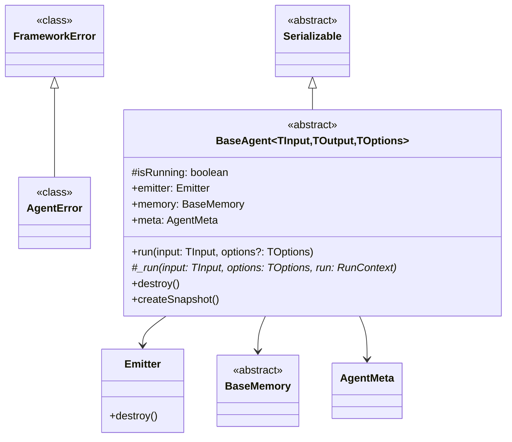

# Agent

The `BaseAgent` class is the foundation of the Bee Framework, providing the core interface and functionality that all agent implementations must follow. It orchestrates the interaction between LLMs, tools, memory, and development utilities to create intelligent, automated workflows.

## Overview

`BaseAgent` acts as an abstract base class that defines the standard interface and basic functionality for all agents in the framework. It manages the lifecycle of agent operations, coordinates between different components, and provides a consistent interface for agent implementations.

## Architecture



> [!TIP]
>
> Location within the framework `bee-agent-framework/agents`.

## Main Methods

### Public Methods

#### `run(prompt: string, options?: ExecutionOptions): Promise<AgentResponse>`

Executes the agent with the given prompt and options.

```ts
interface ExecutionOptions {
  signal?: AbortSignal;
  execution?: {
    maxRetriesPerStep?: number;
    totalMaxRetries?: number;
    maxIterations?: number;
  };
}

const response = await agent.run("What's the weather in Las Vegas?", {
  signal: AbortSignal.timeout(60000),
  execution: {
    maxIterations: 20,
    maxRetriesPerStep: 3,
    totalMaxRetries: 10,
  },
});
```

#### `observe(callback: (emitter: Emitter) => void): void`

Subscribes to agent events for monitoring and debugging.

```ts
const response = await agent
  .run(
    { prompt },
    {
      execution: {
        maxRetriesPerStep: 3,
        totalMaxRetries: 10,
        maxIterations: 20,
      },
      signal: AbortSignal.timeout(2 * 60 * 1000),
    },
  )
  .observe((emitter) => {
    emitter.on("start", () => {
      reader.write(`Agent 🤖 : `, "starting new iteration");
    });
    emitter.on("error", ({ error }) => {
      reader.write(`Agent 🤖 : `, FrameworkError.ensure(error).dump());
    });
    emitter.on("retry", () => {
      reader.write(`Agent 🤖 : `, "retrying the action...");
    });
    emitter.on("update", async ({ data, update, meta }) => {
      // log 'data' to see the whole state
      // to log only valid runs (no errors), check if meta.success === true
      reader.write(`Agent (${update.key}) 🤖 : `, update.value);
    });
    emitter.on("partialUpdate", ({ data, update, meta }) => {
      // ideal for streaming (line by line)
      // log 'data' to see the whole state
      // to log only valid runs (no errors), check if meta.success === true
      // reader.write(`Agent (partial ${update.key}) 🤖 : `, update.value);
    });

    // To observe all events (uncomment following block)
    // emitter.match("*.*", async (data: unknown, event) => {
    //   logger.trace(event, `Received event "${event.path}"`);
    // });
  });
```

## Events

Agent emits various events through its Emitter:

| Event           | Description                      | Payload                                |
| --------------- | -------------------------------- | -------------------------------------- |
| `start`         | New iteration started            | `void`                                 |
| `error`         | Error with framework error dump  | `{ error }`                            |
| `retry`         | Retry attempt initiated          | `void`                                 |
| `update`        | Full state update with metadata  | `{ data, update: {key, value}, meta }` |
| `partialUpdate` | Streaming line-by-line update    | `{ data, update: {key, value}, meta }` |
| `*.*`           | Optional catch-all event matcher | `data, event`                          |

## Implementation Example

Here's an example of usage an simple agent base in Bee Agent class:

```ts
import { BeeAgent } from "bee-agent-framework/agents/bee/agent";
import { TokenMemory } from "bee-agent-framework/memory/tokenMemory";
import { DuckDuckGoSearchTool } from "bee-agent-framework/tools/search/duckDuckGoSearch";
import { OllamaChatLLM } from "bee-agent-framework/adapters/ollama/chat";
import { OpenMeteoTool } from "bee-agent-framework/tools/weather/openMeteo";

const llm = new OllamaChatLLM();
const agent = new BeeAgent({
  llm,
  memory: new TokenMemory({ llm }),
  tools: [new DuckDuckGoSearchTool(), new OpenMeteoTool()],
});

const response = await agent
  .run({ prompt: "What's the current weather in Las Vegas?" })
  .observe((emitter) => {
    emitter.on("update", async ({ data, update, meta }) => {
      console.log(`Agent (${update.key}) 🤖 : `, update.value);
    });
  });

console.log(`Agent 🤖 : `, response.result.text);
```

## Best Practices

1. **Error Handling**

```ts
import { FrameworkError } from "bee-agent-framework/errors";

function getUser() {
  throw new Error("User was not found!");
}

try {
  getUser();
} catch (e) {
  const err = FrameworkError.ensure(e);
  console.log(err.dump());
  console.log(err.explain());
}
```

2. **Memory Management**

```ts
function cleanup(): Promise<void> {
  await this.memory.store("lastCleanup", Date.now());
  // Clear temporary data
}
```

3. **Event Emission**

```ts
function emitProgress(progress: number): void {
  this.agent.emitter.emit("progress", { value: progress });
}
```

4. **Tool Management**

```ts
function validateTools(): Promise<void> {
  for (const tool of this.tools) {
    if (!(await tool.validate())) {
      throw new Error(`Tool validation failed: ${tool.name}`);
    }
  }
}
```

## See Also

- [LLM Documentation](./llms.md)
- [Memory System](./memory.md)
- [Tools Guide](./tools.md)
- [DevTools Reference](./dev_tools.md)
- [Event System](./emitter.md)
