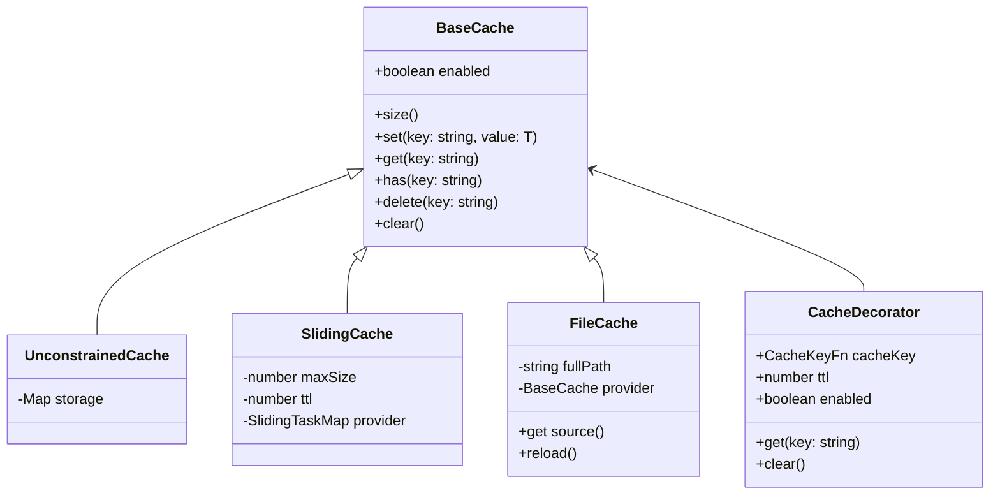

# Cache

The `BaseCache` class is the foundation of the Bee Framework's caching system, providing the core interface and functionality for storing and retrieving computation results and data. It enables performance optimization through temporary storage of expensive operations' results and state management across framework components.

## Overview

`BaseCache` serves as the abstract base class that defines the standard interface for all cache implementations in the framework. It provides consistent methods for data storage, retrieval, and cache management while supporting different caching strategies and persistence mechanisms.

## Architecture



## Core Properties

| Property  | Type          | Description                        |
| --------- | ------------- | ---------------------------------- |
| `enabled` | `boolean`     | Whether caching is active          |
| `storage` | `Map/TaskMap` | Internal storage mechanism         |
| `ttl`     | `number`      | Time-to-live for cache entries     |
| `maxSize` | `number`      | Maximum cache size (if applicable) |

## Cache Implementations

### UnconstrainedCache

Provides unlimited storage capacity with no automatic eviction.

```ts
import { UnconstrainedCache } from "bee-agent-framework/cache/unconstrainedCache";

const cache = new UnconstrainedCache<number>();

await cache.set("key1", 100);
const value = await cache.get("key1"); // 100
console.log(await cache.size()); // 1
```

_Source: [examples/cache/unconstrainedCache.ts](/examples/cache/unconstrainedCache.ts)_

### SlidingCache

Maintains a fixed-size cache with TTL support and LRU eviction.

```ts
import { SlidingCache } from "bee-agent-framework/cache/slidingCache";

const cache = new SlidingCache<string>({
  size: 1000, // Maximum entries
  ttl: 60 * 1000, // 1 minute TTL
});

await cache.set("user:123", userData);
// Oldest entries are removed when time limit is reached
```

_Source: [examples/cache/toolCache.ts](/examples/cache/toolCache.ts)_

### FileCache

Persists cache data to the filesystem.

<!-- embedme examples/cache/fileCache.ts -->

```ts
import { FileCache } from "bee-agent-framework/cache/fileCache";

const cache = new FileCache<UserData>({
  fullPath: "/path/to/cache.json",
});

await cache.set("user:123", userData);
// Data is automatically persisted to disk
```

_Source: [examples/cache/fileCache.ts](/examples/cache/fileCache.ts)_

> [!NOTE]
>
> Provided location (`fullPath`) doesn't have to exist. It gets automatically created when needed.

> [!NOTE]
>
> Every modification to the cache (adding, deleting, clearing) immediately updates the target file.

### Cache Decorator

Method-level caching using TypeScript decorators.

<!-- embedme examples/cache/decoratorCache.ts -->

```ts
import { Cache } from "bee-agent-framework/cache/decoratorCache";

class Generator {
  @Cache()
  get(seed: number) {
    return (Math.random() * 1000) / Math.max(seed, 1);
  }
}

const generator = new Generator();
const a = generator.get(5);
const b = generator.get(5);
console.info(a === b); // true
console.info(a === generator.get(6)); // false
```

_Source: [examples/cache/decoratorCache.ts](/examples/cache/decoratorCache.ts)_

## Integration Examples

### With Tools

```ts
import { SlidingCache } from "bee-agent-framework/cache/slidingCache";
import { WikipediaTool } from "bee-agent-framework/tools/search/wikipedia";

const ddg = new WikipediaTool({
  cache: new SlidingCache({
    size: 100, // max 100 entries
    ttl: 5 * 60 * 1000, // 5 minutes lifespan
  }),
});

// Results are cached automatically
const response = await ddg.run({
  query: "United States",
});
const response2 = await ddg.run({
  query: "United States",
}); // From cache
```

_Source: [examples/cache/toolCache.ts](/examples/cache/toolCache.ts)_

### With LLMs

<!-- embedme examples/cache/llmCache.ts -->

```ts
import { SlidingCache } from "bee-agent-framework/cache/slidingCache";
import { OllamaChatLLM } from "bee-agent-framework/adapters/ollama/chat";
import { BaseMessage } from "bee-agent-framework/llms/primitives/message";

const llm = new OllamaChatLLM({
  modelId: "llama3.1",
  parameters: {
    temperature: 0,
    num_predict: 50,
  },
  cache: new SlidingCache({
    size: 50,
  }),
});

console.info(await llm.cache.size()); // 0
const first = await llm.generate([BaseMessage.of({ role: "user", text: "Who was Alan Turing?" })]);
// upcoming requests with the EXACTLY same input will be retrieved from the cache
console.info(await llm.cache.size()); // 1
const second = await llm.generate([BaseMessage.of({ role: "user", text: "Who was Alan Turing?" })]);
console.info(first === second); // true
```

_Source: [examples/cache/llmCache.ts](/examples/cache/llmCache.ts)_

> [!TIP]
>
> Caching for non-chat LLMs works exactly the same way.

## Cache Key Generation

### Built-in Key Generators

```ts
// Object-based hashing
const objectKey = ObjectHashKeyFn(input);

// Singleton key (same key always)
const singleKey = SingletonCacheKeyFn(input);

// WeakRef-based key generation
const weakKey = WeakRefKeyFn(input);

// JSON stringification
const jsonKey = JSONCacheKeyFn(input);
```

### Custom Key Generation

```ts
const customKeyFn: CacheKeyFn = (...args: any[]) => {
  return args.map((arg) => (typeof arg === "object" ? JSON.stringify(arg) : String(arg))).join(":");
};

class CacheExample {
  @Cache({ cacheKey: customKeyFn })
  method(seed: number) {
    return seed;
  }
}
```

## Custom cache provider implementation

To create your cache implementation, you must implement the `BaseCache` class.

<!-- embedme examples/cache/custom.ts -->

```ts
import { BaseCache } from "bee-agent-framework/cache/base";
import { NotImplementedError } from "bee-agent-framework/errors";

export class CustomCache<T> extends BaseCache<T> {
  size(): Promise<number> {
    throw new NotImplementedError();
  }

  set(key: string, value: T): Promise<void> {
    throw new NotImplementedError();
  }

  get(key: string): Promise<T | undefined> {
    throw new NotImplementedError();
  }

  has(key: string): Promise<boolean> {
    throw new NotImplementedError();
  }

  delete(key: string): Promise<boolean> {
    throw new NotImplementedError();
  }

  clear(): Promise<void> {
    throw new NotImplementedError();
  }

  createSnapshot() {
    throw new NotImplementedError();
  }

  loadSnapshot(snapshot: ReturnType<typeof this.createSnapshot>): void {
    throw new NotImplementedError();
  }
}
```

_Source: [examples/cache/custom.ts](/examples/cache/custom.ts)_

## Best Practices

1. **Cache Strategy Selection**

   ```ts
   // For memory-sensitive applications
   const cache = new SlidingCache({
     size: 1000,
     ttl: 3600 * 1000,
   });

   // For persistent storage needs
   const cache = new FileCache({
     fullPath: "/path/to/cache.json",
   });
   ```

2. **TTL Management**

   ```ts
   // Set appropriate TTL for data freshness
   class DataManager {
     @Cache({
       ttl: 5 * 60 * 1000, // 5 minutes
       enabled: true,
     })
     async fetchData() {
       // Method implementation
     }
   }
   ```

3. **Cache Invalidation**

   ```ts
   // Clear specific entries
   await cache.delete("key");

   // Clear entire cache
   await cache.clear();

   // Selective clearing with decorators
   Cache.getInstance(this, "methodName").clear();
   ```

4. **Resource Management**

   ```ts
   // Monitor cache size
   const size = await cache.size();

   // Enable/disable as needed
   cache.enabled = false;
   ```

## See Also

- [Agent System](./agents.md)
- [Tools System](./tools.md)
- [LLM Integration](./llms.md)
- [Serialization](./serialization.md)
