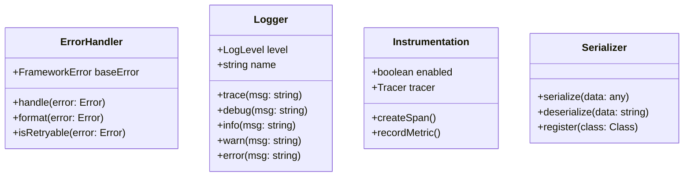

# Developer Tools

The Developer Tools ecosystem in the Bee Framework provides essential functionality for debugging, monitoring, error handling, and maintaining applications. These tools form the foundation for reliable agent operations and development workflows.

## Overview

The Developer Tools system consists of several key components:

- Error Handling System
- Logging System
- Instrumentation and Telemetry
- Serialization System

Each component is designed to work independently while integrating seamlessly with the broader framework.

## Architecture



## Core Components

### Error Handling

The error handling system provides a structured approach to managing and propagating errors throughout the application.

Key features:

- Hierarchical error classification
- Error chaining and context preservation
- Standardized error formatting
- Retry management

[Learn more about Error Handling](./errors.md)

### Logging

A flexible logging system built on top of Pino with enhanced capabilities for agent development.

Key features:

- Multiple log levels
- Structured logging
- Child loggers
- Pretty printing support

[Learn more about Logging](./logger.md)

### Instrumentation

OpenTelemetry integration for comprehensive application monitoring and tracing.

Key features:

- Distributed tracing
- Performance metrics
- Custom span creation
- Flexible configuration

[Learn more about Instrumentation](./instrumentation.md)

### Serialization

Robust serialization system for handling complex object graphs and class instances.

Key features:

- Class-aware serialization
- Circular reference handling
- Custom serializer registration
- Snapshot system

[Learn more about Serialization](./serialization.md)

## Best Practices

1. **Error Handling**

   - Use appropriate error classes for different types of failures
   - Include relevant context in error objects
   - Handle retryable vs non-retryable errors appropriately

2. **Instrumentation**

   - Enable telemetry in production environments
   - Create custom spans for important operations
   - Use meaningful span names and attributes

3. **Logging**

   - Use appropriate log levels
   - Include structured data in log messages
   - Create child loggers for different components

4. **Serialization**
   - Register custom classes before serialization
   - Implement proper snapshot methods
   - Handle circular references carefully

## Environment Configuration

The development tools can be configured through environment variables:

```bash
# Logging
export BEE_FRAMEWORK_LOG_LEVEL=debug
export BEE_FRAMEWORK_LOG_PRETTY=true

# Instrumentation
export BEE_FRAMEWORK_INSTRUMENTATION_ENABLED=true
export INSTRUMENTATION_IGNORED_KEYS="apiToken,accessToken"

# Error Handling
export BEE_FRAMEWORK_ERROR_VERBOSE=true
```

## See Also

- [Agent System](./agent.md)
- [Memory System](./memory.md)
- [Tool System](./tools.md)
- [LLM System](./llms.md)
