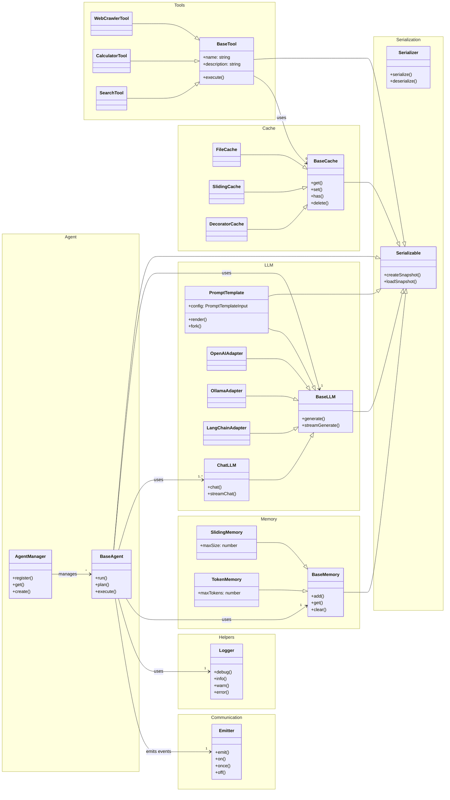

# Bee Framework Class

Diagram with the key classes defined in Bee Framework.

```mermaid
classDiagram
   direction LR

   namespace Tools {
        %% Tools Module
        class BaseTool {
            +name: string
            +description: string
            +execute()
        }
        class WebCrawlerTool
        class CalculatorTool
        class SearchTool
    } 
    
    namespace Agent {
        %% Agents Module
            class BaseAgent {
                +run()
                +plan()
                +execute()
            }
            class AgentManager {
                +register()
                +get()
                +create()
            }
    }

    namespace Memory {
        class BaseMemory {
            +add()
            +get()
            +clear()
        }
        class SlidingMemory {
            +maxSize: number
        }
        class TokenMemory {
            +maxTokens: number
        }
    }

    namespace Cache {
        %% Cache Module
        class BaseCache {
            +get()
            +set()
            +has()
            +delete()
        }
        class FileCache
        class SlidingCache
        class DecoratorCache
    }
    
    namespace LLM {
        class BaseLLM {
            +generate()
            +streamGenerate()
        }
        class ChatLLM {
            +chat()
            +streamChat()
        }
        class PromptTemplate {
            +config: PromptTemplateInput
            +render()
            +fork()
        }

        class OpenAIAdapter
        class OllamaAdapter
        class LangChainAdapter
    }
    
    namespace Serialization {
       class Serializer {
            +serialize()
            +deserialize()
         }
        class Serializable {
            +createSnapshot()
            +loadSnapshot()
        }
    }

    namespace Communication {
        class Emitter {
            +emit()
            +on()
            +once()
            +off()
        }
    }

    namespace Helpers {
        %% Logger Module
        class Logger {
            +debug()
            +info()
            +warn()
            +error()
        }
    }
    
    %% Inheritance Relationships
    BaseAgent --|> Serializable
    BaseLLM --|> Serializable
    BaseMemory --|> Serializable

    SlidingMemory --|> BaseMemory
    TokenMemory --|> BaseMemory

    BaseTool --|> Serializable
    BaseCache --|> Serializable
    PromptTemplate --|> Serializable

    WebCrawlerTool --|> BaseTool
    CalculatorTool --|> BaseTool
    SearchTool --|> BaseTool

    FileCache --|> BaseCache
    SlidingCache --|> BaseCache
    DecoratorCache --|> BaseCache

    ChatLLM --|> BaseLLM
    PromptTemplate --|> BaseLLM

    OpenAIAdapter --|> BaseLLM
    OllamaAdapter --|> BaseLLM
    LangChainAdapter --|> BaseLLM

    %% Associations
    BaseAgent --> "1" BaseLLM : uses
    BaseAgent --> "1..*" ChatLLM : uses
    BaseAgent --> "1" BaseMemory : uses
    BaseAgent --> "1" Logger : uses
    BaseTool --> "0..1" BaseCache : uses
    BaseAgent --> "1" Emitter : emits events
    AgentManager --> "*" BaseAgent : manages
```

You can edit this diagram following [mermaid systax](https://mermaid.js.org/intro/syntax-reference.html).