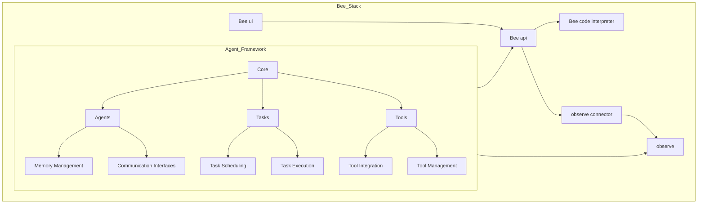

# Bee Stack Components

This diagram shows all the key components in the Bee Stack project

You can edit this diagram following [mermaid systax](https://mermaid.js.org/intro/syntax-reference.html).
