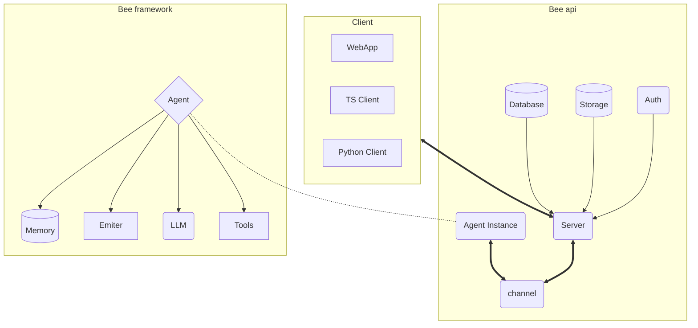

# Bee Stack Services

This diagram shows all the key Services in the Bee Stack project.

```mermaid
flowchart 
    
    subgraph user["Client"]
        WebApp[WebApp]
        TSclient["TS Client"]
        PythonClient["Python Client"]
    end

    subgraph api["Bee api"]

        db[(Database)]
        disk[("Storage")]
        server("Server")
        auth("Auth")
        Queue("channel")
        AgentInstanciate("Agent Instance")
        
        server <==> Queue
        AgentInstanciate <==> Queue
        db --> server
        disk --> server
        auth --> server
    end

    subgraph framework["Bee framework"]
        Agent{Agent}
        Memory[("Memory")]
        Comunication["Emiter"]
        LLM("LLM")
        Tools["Tools"]
        
        Agent --> Memory
        Agent --> Comunication
        Agent --> LLM
        Agent --> Tools
    end

    Agent -.- AgentInstanciate
    user <==> server

```

You can edit this diagram following [mermaid systax](https://mermaid.js.org/intro/syntax-reference.html).