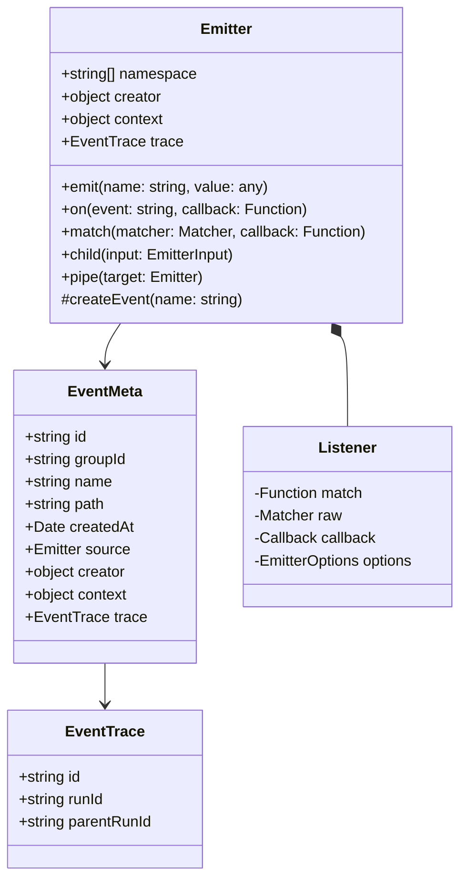

# Emitter

The `Emitter` class is the foundation of the Bee Framework's event system, providing robust observability and event handling capabilities across all framework components. It enables granular monitoring of internal operations, event propagation, and system-wide event handling.

## Overview

`Emitter` serves as the event management system that allows framework components to emit events, propagate them through the system, and enable observers to monitor and react to these events. It provides type-safe event handling with support for complex event hierarchies and filtering.

## Architecture



## Core Properties

| Property    | Type         | Description                     |
| ----------- | ------------ | ------------------------------- |
| `namespace` | `string[]`   | Event namespace hierarchy       |
| `creator`   | `object`     | Object that created the emitter |
| `context`   | `object`     | Contextual data for events      |
| `trace`     | `EventTrace` | Tracing information             |

## Main Methods

### Public Methods

#### `emit(name: string, value: any): Promise<void>`

Emits an event to all registered listeners.

```ts
import { Emitter } from "bee-agent-framework/emitter/emitter";

const emitter = new Emitter({ namespace: ["app"] });

await emitter.emit("start", { id: 123 });
await emitter.emit("end", { id: 123 });
```

_Source: [examples/emitter/base.ts](/examples/emitter/base.ts)_

#### `on(event: string, callback: Function): CleanupFn`

Registers a listener for a specific event.

```ts
import { Emitter } from "bee-agent-framework/emitter/emitter";

const emitter = new Emitter({ namespace: ["app"] });

emitter.on("update", (data, event) => {
  console.log(`Event ${event.name} received with data:`, data);
});

await emitter.emit("update", { id: 123, data: "Hello Bee!" });
```

_Source: [examples/emitter/advanced.ts](/examples/emitter/advanced.ts)_

#### `match(matcher: Matcher, callback: Function): CleanupFn`

Registers a listener with advanced matching capabilities.

<!-- embedme examples/emitter/matchers.ts -->

```ts
import { Callback, Emitter } from "bee-agent-framework/emitter/emitter";
import { BaseLLM } from "bee-agent-framework/llms/base";

interface Events {
  update: Callback<{ data: string }>;
}

const emitter = new Emitter<Events>({
  namespace: ["app"],
});

// Match events by a concrete name (strictly typed)
emitter.on("update", async (data, event) => {});

// Match all events emitted directly on the instance (not nested)
emitter.match("*", async (data, event) => {});

// Match all events (included nested)
emitter.match("*.*", async (data, event) => {});

// Match events by providing a filter function
emitter.match(
  (event) => event.creator instanceof BaseLLM,
  async (data, event) => {},
);

// Match events by regex
emitter.match(/watsonx/, async (data, event) => {});
```

_Source: [examples/emitter/matchers.ts](/examples/emitter/matchers.ts)_

#### `child(input: EmitterInput): Emitter`

Creates a new emitter that inherits from the parent.

```ts
import { Emitter } from "bee-agent-framework/emitter/emitter";

const parentEmitter = new Emitter({ namespace: ["app"] });
const childEmitter = parentEmitter.child({
  namespace: ["bee", "demo"],
  creator: {}, // typically a class
  context: {}, // custom data (propagates to the event's context property)
  groupId: undefined, // optional id for grouping common events (propagates to the event's groupId property)
  trace: undefined, // data related to identity what emitted what and which context (internally used by framework's components)
});
```

_Source: [examples/emitter/advanced.ts](/examples/emitter/advanced.ts)_

### Event Handling

#### Event Types

```ts
import { Callback, Emitter } from "bee-agent-framework/emitter/emitter";

interface Events {
  start: Callback<{ id: number }>;
  progress: Callback<{ id: number; percent: number }>;
  complete: Callback<{ id: number; result: any }>;
}

const emitter = new Emitter<Events>({
  namespace: ["process"],
  context: { service: "background" },
});
```

#### Event Piping/Propagation

<!-- embedme examples/emitter/piping.ts -->

```ts
import { Emitter, EventMeta } from "bee-agent-framework/emitter/emitter";

const first = new Emitter({
  namespace: ["app"],
});

first.match("*.*", (data: unknown, event: EventMeta) => {
  console.log(
    `'first' has retrieved the following event ${event.path}, isDirect: ${event.source === first}`,
  );
});

const second = new Emitter({
  namespace: ["app", "llm"],
});
second.match("*.*", (data: unknown, event: EventMeta) => {
  console.log(
    `'second' has retrieved the following event '${event.path}', isDirect: ${event.source === second}`,
  );
});

// Propagate all events from the 'second' emitter to the 'first' emitter
const unpipe = second.pipe(first);

await first.emit("a", {});
await second.emit("b", {});

console.log("Unpipe");
unpipe();

await first.emit("c", {});
await second.emit("d", {});
```

_Source: [examples/emitter/piping.ts](/examples/emitter/piping.ts)_

## Integration Examples

### With Agents

<!-- embedme examples/emitter/agentMatchers.ts -->

```ts
import { BeeAgent } from "bee-agent-framework/agents/bee/agent";
import { UnconstrainedMemory } from "bee-agent-framework/memory/unconstrainedMemory";
import { OllamaChatLLM } from "bee-agent-framework/adapters/ollama/chat";

const agent = new BeeAgent({
  llm: new OllamaChatLLM(),
  memory: new UnconstrainedMemory(),
  tools: [],
});

// Matching events on the instance level
agent.emitter.match("*.*", (data, event) => {});

await agent
  .run({
    prompt: "Hello agent!",
  })
  .observe((emitter) => {
    // Matching events on the execution (run) level
    emitter.match("*.*", (data, event) => {
      console.info(`RUN LOG: received event '${event.path}'`);
    });
  });
```

_Source: [examples/emitter/agentMatchers.ts](/examples/emitter/agentMatchers.ts)_

> [!IMPORTANT]
>
> The `observe` method is also supported on [`Tools`](./tools.md) and [`LLMs`](./llms.md).

> [!TIP]
>
> The more complex agentic example can be found [here](/examples/agents/bee.ts).

> [!TIP]
>
> To verify if a given class instance has one, check for the presence of the `emitter` property.

### With Tools

> [!IMPORTANT]
>
> The `observe` method is also supported on [`Tools`](./tools.md) and [`LLMs`](./llms.md).

```ts
const tool = new SearchTool();

tool.emitter.match("*.*", (data, event) => {
  console.log(`Tool event: ${event.path}`);
});

await tool.run({ query: "test" }).observe((emitter) => {
  emitter.on("start", (data) => {
    console.log("Search started:", data);
  });

  emitter.on("result", (data) => {
    console.log("Search result:", data);
  });
});
```

## Best Practices

1. **Event Naming**

   ```ts
   // Good - clear, descriptive names
   await emitter.emit("processingStarted", { jobId: "123" });

   // Avoid - unclear names
   await emitter.emit("proc", { id: "123" });
   ```

2. **Context Usage**

   ```ts
   const emitter = new Emitter({
     context: {
       component: "auth",
       version: "1.0",
     },
   });
   ```

3. **Event Cleanup**

   ```ts
   const cleanup = emitter.on("event", callback);
   try {
     // Use emitter
   } finally {
     cleanup();
   }
   ```

4. **Type Safety**

   ```ts
   interface MyEvents {
     start: Callback<{ id: string }>;
     end: Callback<{ id: string; result: any }>;
   }

   const emitter = new Emitter<MyEvents>();
   ```

## See Also

- [Agent System](./agents.md)
- [Tools System](./tools.md)
- [Error Handling](./errors.md)
- [Logging System](./logger.md)
