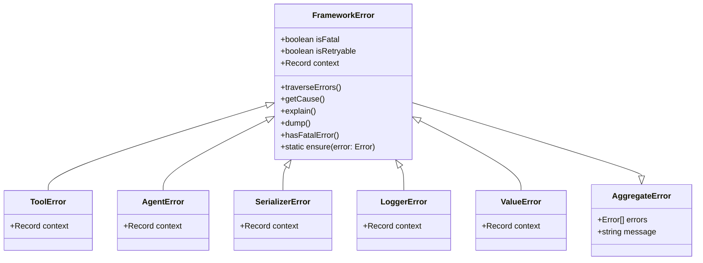

# Error Handling

The `FrameworkError` class is the foundation of the Bee Framework's error handling system, providing a robust and consistent approach to error management across all framework components. Built on Node.js's native `AggregateError`, it enables sophisticated error chaining, contextual information preservation, and standardized error handling patterns.

## Overview

`FrameworkError` serves as the base class for all framework-specific errors, offering enhanced capabilities for error aggregation, context preservation, and error chain management. It provides a consistent interface for error handling while supporting both synchronous and asynchronous operations.

## Architecture



> [!TIP]
>
> Location within the framework `bee-agent-framework/error`.

# Error Handling

All errors thrown within the Bee Agent Framework extend from the base [FrameworkError](/src/errors.ts) class, which itself extends Node.js's native [AggregateError](https://developer.mozilla.org/en-US/docs/Web/JavaScript/Reference/Global_Objects/AggregateError).

Benefits of using `FrameworkError`:

- **Multiple Error Handling**: Supports handling multiple errors simultaneously, which is particularly useful in asynchronous or concurrent operations.
- **Preserved Error Chains**: Retains the full history of errors, giving developers greater context for debugging.
- **Consistent Structure:** All errors across the framework share a uniform structure, simplifying error tracking and management.
- **Native Support:** Built on native Node.js functionality, avoiding the need for additional dependencies while leveraging familiar mechanisms.
- **Utility Functions:** Includes methods for formatting error stack traces and explanations, making them suitable for use with LLMs and other external tools.

This structure ensures that users can trace the complete error history while clearly identifying any errors originating from the Bee Agent Framework.

## Core Properties

| Property      | Type                      | Description                           |
| ------------- | ------------------------- | ------------------------------------- |
| `isFatal`     | `boolean`                 | Indicates if error is unrecoverable   |
| `isRetryable` | `boolean`                 | Indicates if operation can be retried |
| `context`     | `Record<string, unknown>` | Additional error context              |
| `errors`      | `Error[]`                 | Aggregated child errors               |

## Main Methods

### Public Methods

#### `traverseErrors(): Generator<Error>`

Traverses the error chain, yielding all nested errors.

<!-- embedme examples/errors/base.ts -->

```typescript
import { FrameworkError } from "bee-agent-framework/errors";

const error = new FrameworkError(
  "Function 'getUser' has failed.",
  [
    new FrameworkError("Cannot retrieve data from the API.", [
      new Error("User with given ID does not exist!"),
    ]),
  ],
  {
    context: { input: { id: "123" } },
    isFatal: true,
    isRetryable: false,
  },
);

console.log("Message", error.message); // Main error message
console.log("Meta", { fatal: error.isFatal, retryable: error.isRetryable }); // Is the error fatal/retryable?
console.log("Context", error.context); // Context in which the error occurred
```

_Source: [examples/errors/base.ts](/examples/errors/base.ts)_

> [!NOTE]
>
> Every error thrown from the framework is an instance of the `FrameworkError` class, ensuring consistency across the codebase.

#### `explain(): string`

Generates a human-readable explanation of the error chain.

```typescript
import { FrameworkError } from "bee-agent-framework/errors";

const error = new FrameworkError("API call failed", [new Error("Network timeout")], {
  context: { endpoint: "/users" },
  isFatal: false,
});

console.log(error.explain());
// Output:
// API call failed
//   Network timeout
```

> [!TIP]
>
> The `explain()` method is particularly useful for returning a simplified, human-readable error message to an LLM, as used by the Bee Agent.

#### `dump(): string`

Provides a detailed inspection of the error object.

```typescript
const error = new FrameworkError("Data validation failed");
console.log(error.dump());
// Detailed error structure including stack traces
```

### Static Methods

#### `ensure(error: Error): FrameworkError`

Ensures an error is wrapped as a FrameworkError.

```typescript
try {
  throw new Error("Regular error");
} catch (e) {
  const frameworkError = FrameworkError.ensure(e);
  console.log(frameworkError instanceof FrameworkError); // true
}
```

## Specialized Error Types

The Bee Agent Framework extends FrameworkError to create specialized error classes for different components. This ensures that each part of the framework has clear and well-defined error types, improving debugging and error handling.

> [!TIP]
>
> Casting an unknown error to a `FrameworkError` can be done by calling the `FrameworkError.ensure` static method ([example](/examples/errors/cast.ts)).

### ToolError

For errors occurring during tool execution.

```typescript
import { ToolError } from "bee-agent-framework/tools/base";
import { FrameworkError } from "bee-agent-framework/errors";

class ToolError extends FrameworkError {
  constructor(message: string, errors?: Error[], context?: Record<string, any>) {
    super(message, errors, { context });
  }
}
```

_Source: [examples/errors/tool.ts](/examples/errors/tool.ts)_

> [!TIP]
>
> If you throw a `ToolError` intentionally in a custom tool, the framework will not apply any additional "wrapper" errors, preserving the original error context.

### AgentError

For errors occurring during agent execution.

```typescript
class AgentError extends FrameworkError {
  constructor(message: string, errors?: Error[], context?: Record<string, any>) {
    super(message, errors, { context });
  }
}
```

### Other Specialized Types

- `SerializerError`: For serialization/deserialization errors
- `LoggerError`: For logging system errors
- `ValueError`: For value validation errors
- `NotImplementedError`: For unimplemented features
- `AbortError`: For cancelled operations

## Error Handling Examples

### Basic Error Creation

```typescript
const error = new FrameworkError("Operation failed", [new Error("Root cause")], {
  context: { operation: "data-fetch" },
  isFatal: true,
  isRetryable: false,
});
```

### Error Chaining

```typescript
const rootError = new Error("Database connection failed");
const middlewareError = new FrameworkError("Query execution failed", [rootError]);
const applicationError = new FrameworkError("Data retrieval failed", [middlewareError]);

console.log(applicationError.getCause().message); // "Database connection failed"
```

### Error in Tools

```typescript
try {
  await tool.execute();
} catch (error) {
  if (error instanceof ToolError) {
    console.log(error.explain());
    if (error.isRetryable) {
      // Attempt retry
    }
  }
}
```

## Best Practices

1. **Error Creation**

   ```typescript
   throw new FrameworkError("Clear, descriptive message", [originalError], {
     context: { relevant: "data" },
     isFatal: whenUnrecoverable,
     isRetryable: whenRetryPossible,
   });
   ```

2. **Context Preservation**

   ```typescript
   catch (error) {
     throw new FrameworkError("Higher-level context", [error], {
       context: { ...error.context, newInfo: "value" }
     });
   }
   ```

3. **Error Recovery**

   ```typescript
   if (!error.hasFatalError() && error.isRetryable) {
     // Implement retry logic
   }
   ```

4. **Error Reporting**
   ```typescript
   logger.error({
     message: error.explain(),
     context: error.context,
     stack: error.stack,
   });
   ```

## See Also

- [Agent System](./agent.md)
- [Tools System](./tools.md)
- [Logging System](./logger.md)
- [Serialization System](./serialization.md)
