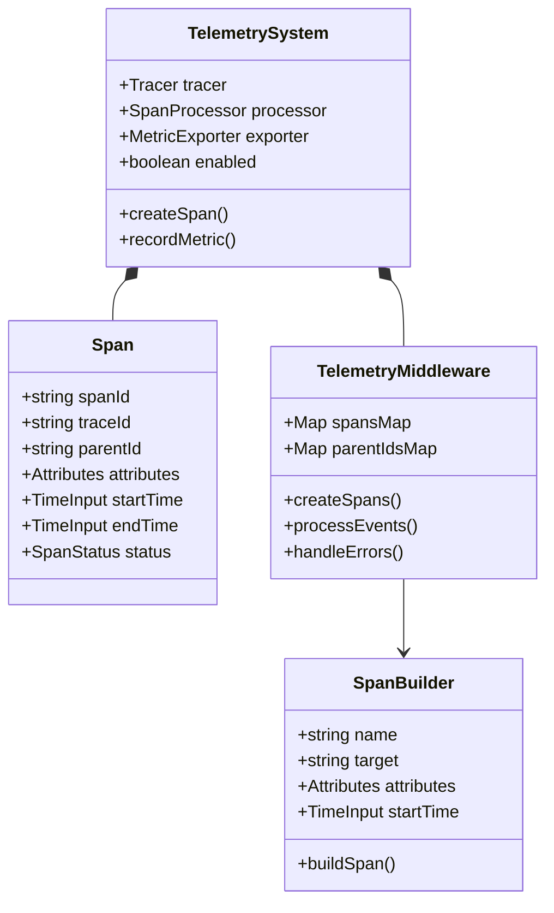

# Instrumentation

The OpenTelemetry instrumentation system in the Bee Framework provides comprehensive observability capabilities through distributed tracing, metrics collection, and performance monitoring. It enables developers to gain deep insights into agent operations, LLM interactions, and tool executions.

## Overview

The instrumentation system uses OpenTelemetry to provide detailed telemetry data across all framework components. It automatically creates spans, records metrics, and tracks performance when enabled, offering valuable insights into system behavior and performance.

OpenTelemetry instrumentation allows you to collect telemetry data, such as traces and metrics, to monitor the performance of your services.
This setup involves creating middleware to handle instrumentation automatically when the `INSTRUMENTATION_ENABLED` flag is active.

## Architecture



## Core Components

### Tracer Configuration

```typescript
const tracer = opentelemetry.trace.getTracer("bee-agent-framework", Version);
```

### Span Creation

```typescript
interface SpanAttributes {
  ctx?: Attributes;
  data?: Attributes;
  target: string;
}

interface FrameworkSpan {
  attributes: SpanAttributes;
  context: {
    span_id: string;
  };
  name: string;
  parent_id?: string;
  start_time: TimeInput;
  end_time: TimeInput;
  status: SpanStatus;
}
```

## Integration Examples

### With Agents

```typescript
const agent = new BeeAgent({
  llm,
  memory,
  tools,
}).middleware(createTelemetryMiddleware());

await agent.run({
  prompt: "Hello",
  devTools: {
    enableTelemetry: true,
  },
});
```

### With LLMs

```typescript
const llm = new ChatLLM().middleware(createTelemetryMiddleware());

await llm.generate([{ role: "user", text: "Hello" }], {
  telemetry: true,
});
```

### With Tools

```typescript
const tool = new SearchTool().middleware(createTelemetryMiddleware());

await tool.run(
  {
    query: "test",
  },
  {
    telemetry: true,
  },
);
```

## Configuration

Follow the official OpenTelemetry [Node.js Getting Started Guide](https://opentelemetry.io/docs/languages/js/getting-started/nodejs/) to initialize and configure OpenTelemetry in your application.

### Environment Variables

```bash
# Enable instrumentation
export BEE_FRAMEWORK_INSTRUMENTATION_ENABLED=true

# Configure ignored keys for sensitive data
export BEE_FRAMEWORK_INSTRUMENTATION_IGNORED_KEYS=apiKey,secret,token

# Set logging level for instrumentation
export BEE_FRAMEWORK_LOG_LEVEL=debug
```

## Span Creation Patterns

### Basic Span

You can manually create spans during the `run` process to track specific parts of the execution. This is useful for adding custom telemetry to enhance observability.

Example of creating a span:

```typescript
import { trace } from "@opentelemetry/api";

const tracer = trace.getTracer("bee-agent-framework");

function exampleFunction() {
  const span = tracer.startSpan("example-function-span");
  try {
    // Your code logic here
  } catch (error) {
    span.recordException(error);
    throw error;
  } finally {
    span.end();
  }
}
```

## Event Tracking

```typescript
emitter.match("*.*", (data, meta) => {
  const span = createSpan({
    id: meta.id,
    name: meta.name,
    target: meta.path,
    data: getSerializedObjectSafe(data),
    ctx: getSerializedObjectSafe(meta.context),
    startedAt: meta.createdAt,
  });
});
```

## Verifying Instrumentation

Once you have enabled the instrumentation, you can view telemetry data using any [compatible OpenTelemetry backend](https://opentelemetry.io/docs/languages/js/exporters/), such as [Jaeger](https://www.jaegertracing.io/), [Zipkin](https://zipkin.io/), [Prometheus](https://prometheus.io/docs/prometheus/latest/feature_flags/#otlp-receiver), etc...
Ensure your OpenTelemetry setup is properly configured to export trace data to your chosen backend.

### Run examples

> the right version of node.js must be correctly set

```
nvm use
```

## Best Practices

1. **Span Management**

   ```typescript
   try {
     const span = tracer.startSpan("operation");
     // Operation logic
   } catch (error) {
     span.recordException(error);
     span.setStatus({ code: SpanStatusCode.ERROR });
     throw error;
   } finally {
     span.end();
   }
   ```

2. **Attribute Handling**

   ```typescript
   span.setAttributes({
     "operation.name": name,
     "operation.params": JSON.stringify(params),
     "operation.result": JSON.stringify(result),
   });
   ```

3. **Error Tracking**

   ```typescript
   function handleError(error: Error, span: Span) {
     span.recordException(error);
     span.setStatus({
       code: SpanStatusCode.ERROR,
       message: error.message,
     });
   }
   ```

4. **Performance Monitoring**
   ```typescript
   const startTime = performance.now();
   // Operation
   span.setAttributes({
     "duration.ms": performance.now() - startTime,
   });
   ```

## Visualization and Monitoring

### Compatible Backends

- Jaeger
- Zipkin
- Prometheus
- OpenTelemetry Collector

### Example Configuration

```typescript
import { JaegerExporter } from "@opentelemetry/exporter-jaeger";

const exporter = new JaegerExporter({
  endpoint: "http://localhost:14268/api/traces",
});

const spanProcessor = new BatchSpanProcessor(exporter);
provider.addSpanProcessor(spanProcessor);
```

## Security Considerations

1. **Sensitive Data**

   - Use `INSTRUMENTATION_IGNORED_KEYS` for sensitive fields
   - Sanitize data before recording in spans
   - Avoid logging credentials or secrets

2. **Resource Usage**
   - Monitor telemetry overhead
   - Use sampling when necessary
   - Configure appropriate batch sizes

## See Also

- [Agent System](./agent.md)
- [LLM System](./llms.md)
- [Tools System](./tools.md)
- [Logging System](./logger.md)
