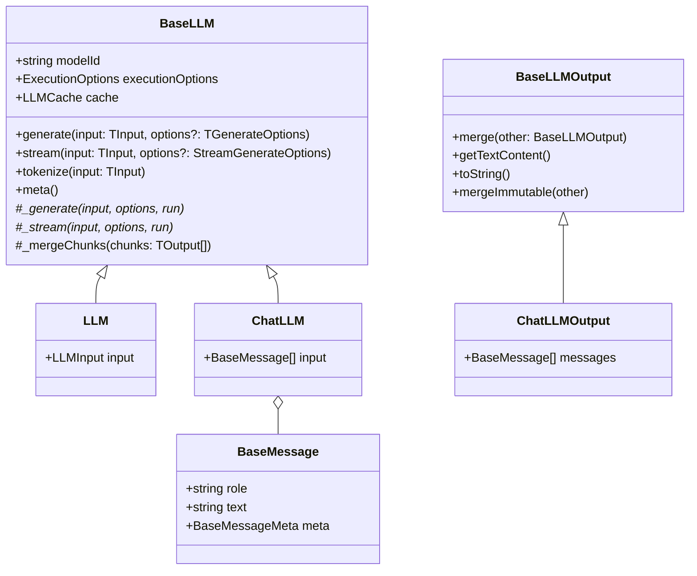

# LLM

The `BaseLLM` class is the foundation of the Bee Framework's language model integration system, providing the core interface and functionality for interacting with various LLM providers. It serves as the abstract base class that all LLM implementations must extend.

## Overview

`BaseLLM` defines the standard interface and basic functionality for LLM interactions in the framework. It handles text generation, chat completions, token management, and provides a consistent interface for different LLM implementations like chat-based, completion-based, and specialized LLM types.

## Architecture



> [!TIP]
>
> Location for concrete implementations within the framework `bee-agent-framework/adapters`.
>
> Location for base abstraction within the framework `bee-agent-framework/llms`.

## Core Properties

| Property           | Type               | Description                                   |
| ------------------ | ------------------ | --------------------------------------------- |
| `modelId`          | `string`           | Identifier for the LLM model                  |
| `executionOptions` | `ExecutionOptions` | Configuration for execution behavior          |
| `cache`            | `LLMCache`         | Cache system for LLM responses                |
| `emitter`          | `Emitter`          | Event emitter for monitoring LLM interactions |

## Main Methods

### Public Methods

#### `generate(input: TInput, options?: TGenerateOptions): Promise<TOutput>`

Generates a response from the LLM based on the provided input.

```ts
// Text LLM
const llm = new TextLLM({ modelId: "model-name" });
const response = await llm.generate("What is the capital of France?", {
  stream: false,
  signal: AbortSignal.timeout(30000),
});

// Chat LLM
const chatLlm = new ChatLLM({ modelId: "chat-model" });
const messages = [
  BaseMessage.of({
    role: "user",
    text: "Who won the 2024 Super Bowl?",
  }),
];
const chatResponse = await chatLlm.generate(messages);
```

#### `stream(input: TInput, options?: StreamGenerateOptions): AsyncGenerator<TOutput>`

Streams the LLM's response as it's being generated.

```ts
const llm = new ChatLLM({ modelId: "streaming-model" });
for await (const chunk of llm.stream(messages, {
  signal: AbortSignal.timeout(30000),
})) {
  console.log(chunk.getTextContent());
}
```

#### `tokenize(input: TInput): Promise<BaseLLMTokenizeOutput>`

Returns token information for the provided input.

```ts
const tokenInfo = await llm.tokenize("Hello, world!");
console.log(tokenInfo.tokensCount); // Number of tokens
console.log(tokenInfo.tokens); // Array of token strings if available
```

## Supported Providers

| Name                                                                      | LLM                        | Chat LLM                                      | Structured output (constrained decoding) |
| ------------------------------------------------------------------------- | -------------------------- | --------------------------------------------- | ---------------------------------------- |
| `WatsonX`                                                                 | ✅                         | ⚠️ (model specific template must be provided) | ❌                                       |
| `Ollama`                                                                  | ✅                         | ✅                                            | ⚠️ (JSON only)                           |
| `OpenAI`                                                                  | ❌                         | ✅                                            | ⚠️ (JSON schema only)                    |
| `Azure OpenAI`                                                            | ❌                         | ✅                                            | ⚠️ (JSON schema only)                    |
| `LangChain`                                                               | ⚠️ (depends on a provider) | ⚠️ (depends on a provider)                    | ❌                                       |
| `Groq`                                                                    | ❌                         | ✅                                            | ⚠️ (JSON object only)                    |
| `AWS Bedrock`                                                             | ❌                         | ✅                                            | ⚠️ (JSON only) - model specific          |
| `VertexAI`                                                                | ✅                         | ✅                                            | ⚠️ (JSON only)                           |
| `BAM (Internal)`                                                          | ✅                         | ⚠️ (model specific template must be provided) | ✅                                       |
| ➕ [Request](https://github.com/i-am-bee/bee-agent-framework/discussions) |                            |                                               |                                          |

✅ Full support
⚠️ Partial support/limitations
❌ Not supported

All providers' examples can be found in [examples/llms/providers](/examples/llms/providers).

Are you interested in creating your own adapter? Jump to the [adding a new provider](#adding-a-new-provider-adapter) section.

## Implementation Example

Here's an example of implementing a custom LLM provider:

```ts
class CustomLLMOutput extends BaseLLMOutput {
  constructor(
    private content: string,
    private metadata: Record<string, any> = {},
  ) {
    super();
  }

  merge(other: CustomLLMOutput): void {
    this.content += other.content;
    Object.assign(this.metadata, other.metadata);
  }

  getTextContent(): string {
    return this.content;
  }

  toString(): string {
    return this.content;
  }
}

class CustomLLM extends LLM<CustomLLMOutput> {
  public readonly emitter = new Emitter<GenerateCallbacks>();

  async meta(): Promise<LLMMeta> {
    return {
      tokenLimit: 4096,
    };
  }

  async tokenize(input: string): Promise<BaseLLMTokenizeOutput> {
    return {
      tokensCount: Math.ceil(input.length / 4),
    };
  }

  protected async _generate(
    input: string,
    options: GenerateOptions,
    run: RunContext,
  ): Promise<CustomLLMOutput> {
    // Implementation for one-shot generation
    const response = await this.callApi(input);
    return new CustomLLMOutput(response.text, response.meta);
  }

  protected async *_stream(
    input: string,
    options: StreamGenerateOptions,
    run: RunContext,
  ): AsyncGenerator<CustomLLMOutput> {
    // Implementation for streaming generation
    for await (const chunk of this.streamApi(input)) {
      yield new CustomLLMOutput(chunk);
    }
  }
}
```

## Best Practices

1. **Error Handling**

   ```ts
   try {
     const response = await llm.generate(input);
   } catch (error) {
     if (error instanceof LLMFatalError) {
       // Handle unrecoverable errors
     } else if (error instanceof LLMError) {
       // Handle recoverable errors
     }
   }
   ```

2. **Stream Management**

   ```ts
   const controller = new AbortController();
   setTimeout(() => controller.abort(), 30000);

   for await (const chunk of llm.stream(input, {
     signal: controller.signal,
   })) {
     // Process chunks
   }
   ```

3. **Event Handling**

   ```ts
   const response = await llm.generate(input).observe((emitter) => {
     emitter.on("newToken", ({ data }) => {
       console.log("New token:", data.value.getTextContent());
     });
     emitter.on("error", ({ data }) => {
       console.error("Error:", data.error);
     });
   });
   ```

4. **Cache Usage**
   ```ts
   const llm = new CustomLLM({
     modelId: "model-name",
     cache: new CustomCache(),
   });
   ```

## See Also

- [Memory System](./memory.md)
- [Agent System](./agents.md)
- [Event System (emitter)](./emitter.md)
