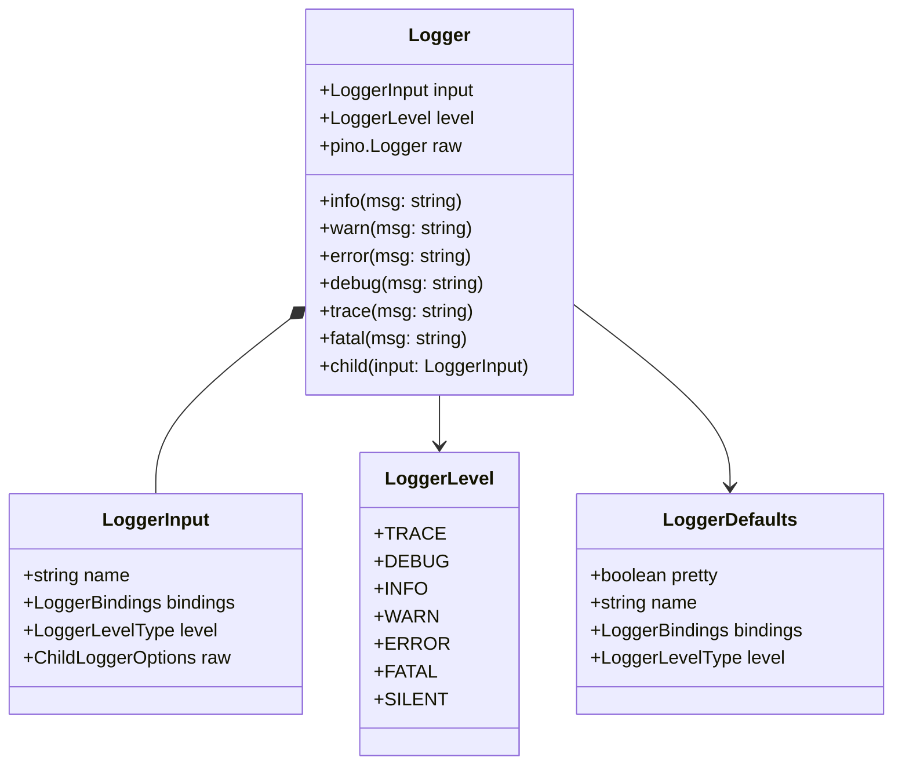

# Logger

The `Logger` class is the foundation of the Bee Framework's logging system, providing robust logging capabilities built on top of the Pino logger. It enables comprehensive system monitoring, debugging, and troubleshooting through structured logging with multiple severity levels and flexible configuration options.

## Overview

`Logger` serves as an abstraction layer over Pino, offering enhanced functionality for structured logging, child loggers, and framework integration. It provides consistent logging patterns across all framework components while supporting customization and extension.

In the Bee Agent Framework, the [Logger](/src/logger/logger.ts) class is an abstraction built on top of the popular [pino](https://github.com/pinojs/pino) logger, offering additional flexibility and integration.

## Architecture



## Core Properties

| Property   | Type              | Description              |
| ---------- | ----------------- | ------------------------ |
| `level`    | `LoggerLevelType` | Current logging level    |
| `input`    | `LoggerInput`     | Logger configuration     |
| `raw`      | `pino.Logger`     | Underlying Pino instance |
| `defaults` | `LoggerDefaults`  | Global default settings  |

## Logging Levels

```ts
const LoggerLevel = {
  TRACE: "trace", // Most detailed logging
  DEBUG: "debug", // Debug information
  INFO: "info", // General information
  WARN: "warn", // Warning messages
  ERROR: "error", // Error conditions
  FATAL: "fatal", // Critical failures
  SILENT: "silent", // No logging
};
```

## Main Methods

### Public Methods

#### `child(input?: LoggerInput): Logger`

Creates a new logger instance inheriting from the parent.

<!-- embedme examples/logger/base.ts -->

```ts
import { Logger, LoggerLevel } from "bee-agent-framework/logger/logger";

// Configure logger defaults
Logger.defaults.pretty = true; // Pretty-print logs (default: false, can also be set via ENV: BEE_FRAMEWORK_LOG_PRETTY=true)
Logger.defaults.level = LoggerLevel.TRACE; // Set log level to trace (default: TRACE, can also be set via ENV: BEE_FRAMEWORK_LOG_LEVEL=trace)
Logger.defaults.name = undefined; // Optional name for logger (default: undefined)
Logger.defaults.bindings = {}; // Optional bindings for structured logging (default: empty)

const parentLogger = Logger.root.child({ name: "app" });
const moduleLogger = parentLogger.child({
  name: "module",
  level: "debug",
});
```

#### Logging Methods

```ts
import { Logger, LoggerLevel } from "bee-agent-framework/logger/logger";

Logger.defaults.level = LoggerLevel.TRACE; // Set log level to trace (default: TRACE, can also be set via ENV: BEE_FRAMEWORK_LOG_LEVEL=trace)

logger.trace("Detailed debugging information");
logger.debug("Debugging information");
logger.info("General information");
logger.warn("Warning messages");
logger.error("Error conditions");
logger.fatal("Critical failures");
```

_Source: [examples/logger/base.ts](/examples/logger/base.ts)_

## Configuration

### Environment Variables

```bash
# Enable pretty printing
export BEE_FRAMEWORK_LOG_PRETTY=true

# Set default log level
export BEE_FRAMEWORK_LOG_LEVEL=debug

# Enable single-line logging
export BEE_FRAMEWORK_LOG_SINGLE_LINE=true
```

### Default Configuration

```ts
import { Logger } from "bee-agent-framework/logger/logger";

Logger.defaults = {
  pretty: false, // Pretty printing
  name: undefined, // Logger name
  level: "info", // Default level
  bindings: {}, // Default bindings
};
```

## Integration Examples

### With Agents

The [Logger](/src/logger/logger.ts) seamlessly integrates with agents in the framework. Below is an example that demonstrates how logging can be used in conjunction with agents and event emitters.

<!-- embedme examples/logger/agent.ts -->

```ts
import { BeeAgent } from "bee-agent-framework/agents/bee/agent";
import { OllamaChatLLM } from "bee-agent-framework/adapters/ollama/chat";
import { UnconstrainedMemory } from "bee-agent-framework/memory/unconstrainedMemory";
import { Logger } from "bee-agent-framework/logger/logger";
import { Emitter } from "bee-agent-framework/emitter/emitter";

// Set up logging
Logger.defaults.pretty = true;

const logger = Logger.root.child({
  level: "trace",
  name: "app",
});

// Log events emitted during agent execution
Emitter.root.match("*.*", (data, event) => {
  const logLevel = event.path.includes(".run.") ? "trace" : "info";
  logger[logLevel](`Event '${event.path}' triggered by '${event.creator.constructor.name}'.`);
});

// Create and run an agent
const agent = new BeeAgent({
  llm: new OllamaChatLLM(),
  memory: new UnconstrainedMemory(),
  tools: [],
});

const response = await agent.run({ prompt: "Hello!" });
logger.info(response.result.text);
```

_Source: [examples/logger/agent.ts](/examples/logger/agent.ts)_

### With Custom Pino Instance

If you need to integrate your own `pino` instance with the Bee Agent Framework Logger, you can do so easily. Below is an example that demonstrates how to create a pino logger and use it with the framework’s [Logger](/src/logger/logger.ts).

<!-- embedme examples/logger/pino.ts -->

```ts
import { Logger } from "bee-agent-framework/logger/logger";
import { pino } from "pino";

// Create a custom pino logger
const customLogger = pino({
  name: "app",
});

// Use the custom pino instance within the framework
const frameworkLogger = new Logger(
  {
    level: "info", // Set the log level
    name: "framework", // Set the logger name
  },
  customLogger, // Pass the custom pino instance
);
```

_Source: [examples/logger/pino.ts](/examples/logger/pino.ts)_

## Pretty Printing

```ts
// Enable pretty printing with custom options
Logger.defaults.pretty = true;

const logger = Logger.root.child({
  name: "pretty-logger",
});

logger.info("This will be pretty printed!");
// Output: 2024-02-28 14:30:45 INF ℹ️ [pretty-logger] This will be pretty printed!
```

## Best Practices

1. **Logger Hierarchy**

   ```ts
   const appLogger = Logger.root.child({ name: "app" });
   const dbLogger = appLogger.child({ name: "database" });
   const apiLogger = appLogger.child({ name: "api" });
   ```

2. **Structured Logging**

   ```ts
   logger.info({
     operation: "user-login",
     userId: "123",
     status: "success",
   });
   ```

3. **Error Logging**

   ```ts
   try {
     await operation();
   } catch (error) {
     logger.error({
       error,
       context: "operation-name",
       inputs: operationInputs,
     });
   }
   ```

4. **Performance Monitoring**
   ```ts
   const start = performance.now();
   // Operation
   logger.debug({
     operation: "task-name",
     duration: performance.now() - start,
   });
   ```

## See Also

- [Agent System](./agents.md)
- [Error Handling](./errors.md)
- [Instrumentation](./instrumentation.md)
- [Event System (emitter)](./emitter.md)
