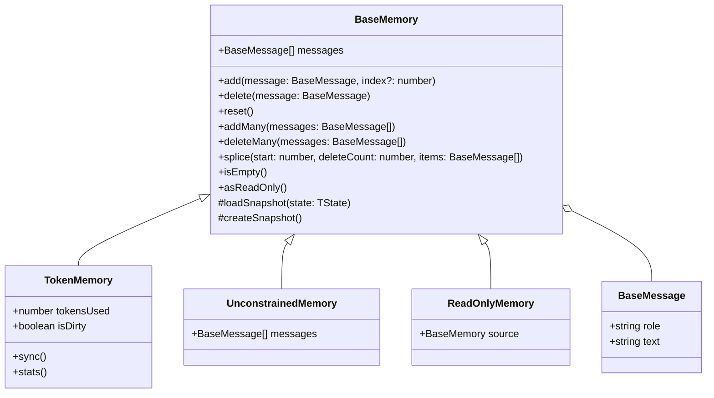

# Memory

The `BaseMemory` class is the foundation of the Bee Framework's memory system, providing the core interface and functionality for managing conversation history, context retention, and state management across agent interactions. It serves as the abstract base class that all memory implementations must extend.

## Overview

`BaseMemory` defines the standard interface and basic functionality for memory management in the framework. It handles message storage, retrieval, and manipulation while providing a consistent interface for different memory implementations like token-based, unconstrained, and specialized memory types.

## Architecture



## Core Properties

| Property            | Type                     | Description                          |
| ------------------- | ------------------------ | ------------------------------------ |
| `messages`          | `readonly BaseMessage[]` | Array of stored messages             |
| `isEmpty()`         | `boolean`                | Whether memory contains any messages |
| `[Symbol.iterator]` | `Iterator`               | Allows iteration over messages       |

## Main Methods

### Public Methods

#### `add(message: BaseMessage, index?: number): Promise<void>`

Adds a new message to memory at the specified index.

```ts
await memory.add(
  BaseMessage.of({
    role: "user",
    text: "What's the weather like?",
  }),
);

// Add at specific index
await memory.add(systemMessage, 0);
```

#### `delete(message: BaseMessage): Promise<boolean>`

Removes a message from memory.

```ts
const deleted = await memory.delete(message);
console.log(`Message ${deleted ? "was" : "was not"} deleted`);
```

#### `addMany(messages: Iterable<BaseMessage>, start?: number): Promise<void>`

Adds multiple messages to memory.

```ts
await memory.addMany([
  BaseMessage.of({ role: "user", text: "Hello" }),
  BaseMessage.of({ role: "assistant", text: "Hi there!" }),
]);
```

#### `reset(): void`

Clears all messages from memory.

```ts
memory.reset();
console.log(memory.isEmpty()); // true
```

## Memory Implementations

### TokenMemory

Manages messages while respecting token limits, suitable for LLM context windows.

```ts
const memory = new TokenMemory({
  llm,
  maxTokens: 4096,
  capacityThreshold: 0.75,
  syncThreshold: 0.25,
  handlers: {
    estimate: (msg) => Math.ceil((msg.role.length + msg.text.length) / 4),
    removalSelector: (messages) => messages[0],
  },
});

console.log(memory.stats());
// {
//   tokensUsed: 1024,
//   maxTokens: 4096,
//   messagesCount: 10,
//   isDirty: false
// }
```

### UnconstrainedMemory

Simple memory implementation with no size or token limits.

```ts
const memory = new UnconstrainedMemory();

await memory.add(
  BaseMessage.of({
    role: "system",
    text: "You are a helpful assistant",
  }),
);

console.log(memory.messages.length);
```

### ReadOnlyMemory

Wrapper providing read-only access to another memory instance.

```ts
const readOnly = memory.asReadOnly();
await readOnly.add(message); // No effect
console.log(readOnly.messages); // Same as source memory
```

## Best Practices

1. **Memory Management**

   ```ts
   // Clean up messages when done
   memory.reset();

   // Use read-only memory when passing to untrusted code
   const safeMemory = memory.asReadOnly();
   ```

2. **Error Handling**

   ```ts
   try {
     await memory.add(message);
   } catch (error) {
     if (error instanceof MemoryError) {
       // Handle unrecoverable errors
     }
   }
   ```

3. **State Persistence**

   ```ts
   // Save memory state
   const snapshot = memory.createSnapshot();

   // Restore from snapshot
   memory.loadSnapshot(snapshot);
   ```

## Implementation Example

Here's an example of implementing a custom memory system:

```ts
class CustomMemory extends BaseMemory {
  private messages: BaseMessage[] = [];

  async add(message: BaseMessage, index?: number) {
    const targetIndex = index ?? this.messages.length;
    this.messages.splice(targetIndex, 0, message);
  }

  async delete(message: BaseMessage) {
    const index = this.messages.indexOf(message);
    if (index >= 0) {
      this.messages.splice(index, 1);
      return true;
    }
    return false;
  }

  reset() {
    this.messages = [];
  }

  createSnapshot() {
    return {
      messages: [...this.messages],
    };
  }

  loadSnapshot(state: ReturnType<typeof this.createSnapshot>) {
    this.messages = [...state.messages];
  }
}
```

## See Also

- [Agent Documentation](./agent.md)
- [LLM Integration](./llms.md)
- [Message System](./messages.md)
- [Serialization](./serialization.md)
