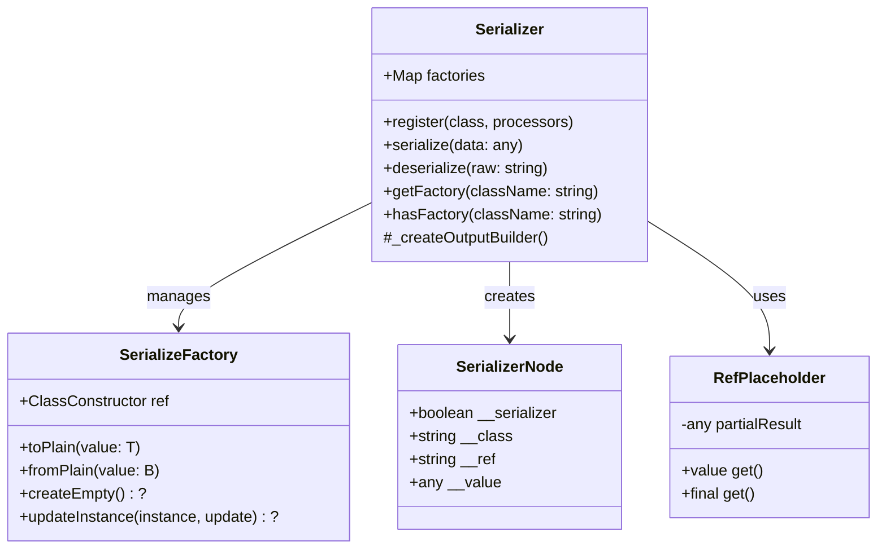

# Serialization

The `Serializer` class is the foundation of the Bee Framework's serialization system, providing robust functionality for converting complex data structures and objects into a format suitable for storage and transmission. It handles circular references, complex object graphs, and framework-specific data types with built-in type safety.

## Overview

`Serializer` serves as the central system for managing serialization and deserialization of objects throughout the framework. It provides a registry-based approach to handling different types, supports circular dependencies, and maintains object references during the serialization process.

## Architecture



## Core Properties

| Property    | Type                            | Description                        |
| ----------- | ------------------------------- | ---------------------------------- |
| `factories` | `Map<string, SerializeFactory>` | Registry of serialization handlers |
| `enabled`   | `boolean`                       | Whether serialization is active    |
| `version`   | `string`                        | Serialization format version       |

## Main Methods

### Public Methods

#### `serialize(data: any): string`

Converts an object into a serialized string representation.

```typescript
import { Serializer } from "bee-agent-framework/serializer/serializer";

const data = {
  date: new Date(),
  map: new Map([["key", "value"]]),
  set: new Set([1, 2, 3]),
};
const serialized = Serializer.serialize(data);
```

_Source: [examples/serialization/base.ts](/examples/tools/base.ts)_

> [!NOTE]
>
> Serializer knows how to serialize/deserialize the most well-known JavaScript data structures. Continue reading to see how to register your own.

#### `deserialize<T>(raw: string, extraClasses?: SerializableClass[]): T`

Reconstructs an object from its serialized form.

```typescript
const original = {
  buffer: Buffer.from("Hello"),
  regex: /test/g,
  date: new Date(),
};

const serialized = Serializer.serialize(original);
const restored = Serializer.deserialize(serialized);
```

### Registration Methods

#### `register<A, B>(ref: ClassConstructor<A>, processors: SerializeFactory<A, B>): void`

Registers a new class for serialization support.

```typescript
class CustomType {
  constructor(public data: string) {}
}

Serializer.register(CustomType, {
  toPlain: (instance) => ({
    data: instance.data,
  }),
  fromPlain: (plain) => new CustomType(plain.data),
  createEmpty: () => new CustomType(""),
  updateInstance: (instance, update) => {
    instance.data = update.data;
  },
});
```

## Built-in Type Support

### Primitive Types

```typescript
// Built-in handlers for primitive types
Serializer.register(Number, {
  toPlain: (value) => value.toString(),
  fromPlain: (value) => Number(value),
});

Serializer.register(String, {
  toPlain: (value) => String(value),
  fromPlain: (value) => String(value),
});

Serializer.register(Boolean, {
  toPlain: (value) => Boolean(value),
  fromPlain: (value) => Boolean(value),
});
```

### Complex Types

```typescript
// Built-in handlers for complex types
Serializer.register(Map, {
  toPlain: (value) => Array.from(value.entries()),
  fromPlain: (value) => new Map(value),
});

Serializer.register(Set, {
  toPlain: (value) => Array.from(value.values()),
  fromPlain: (value) => new Set(value),
});

Serializer.register(Date, {
  toPlain: (value) => value.toISOString(),
  fromPlain: (value) => new Date(value),
});
```

## Implementation Examples

Most parts of the framework implement the internal [`Serializable`](/src/internals/serializable.ts) class, which exposes the following methods.

- `createSnapshot` (returns an object that "snapshots" the current state)
- `loadSnapshot` (applies the provided snapshot to the current instance)

- `fromSerialized` (static, creates the new instance from the given serialized input)
- `fromSnapshot` (static, creates the new instance from the given snapshot)

### With tools

<!-- embedme examples/serialization/memory.ts -->

```typescript
import { TokenMemory } from "bee-agent-framework/memory/tokenMemory";
import { OllamaChatLLM } from "bee-agent-framework/adapters/ollama/chat";
import { BaseMessage } from "bee-agent-framework/llms/primitives/message";

const llm = new OllamaChatLLM();
const memory = new TokenMemory({ llm });
await memory.addMany([
  BaseMessage.of({
    role: "user",
    text: "What is your name?",
  }),
]);

const serialized = memory.serialize();
const deserialized = TokenMemory.fromSerialized(serialized);

await deserialized.add(
  BaseMessage.of({
    role: "assistant",
    text: "Bee",
  }),
);
```

_Source: [examples/serialization/memory.ts](/examples/serialization/memory.ts)_

### Custom Class Registration

```typescript
class UserProfile {
  constructor(
    public name: string,
    public createdAt: Date,
  ) {}
}

Serializer.register(UserProfile, {
  toPlain: (instance) => ({
    name: instance.name,
    createdAt: instance.createdAt,
  }),
  fromPlain: (data) => new UserProfile(data.name, new Date(data.createdAt)),
  // For circular references
  createEmpty: () => new UserProfile("", new Date()),
  updateInstance: (instance, update) => {
    Object.assign(instance, update);
  },
});
```

### Handling Circular References

```typescript
class Node {
  constructor(
    public value: string,
    public next?: Node,
  ) {}
}

Serializer.register(Node, {
  toPlain: (instance) => ({
    value: instance.value,
    next: instance.next,
  }),
  fromPlain: (data) => new Node(data.value, data.next),
  createEmpty: () => new Node(""),
  updateInstance: (instance, update) => {
    instance.value = update.value;
    instance.next = update.next;
  },
});
```

### Serializing unknowns

If you want to serialize a class that the `Serializer` does not know, it throws the `SerializerError` error.
However, you can tell the `Serializer` how to work with your class by registering it as a serializable.

<!-- embedme examples/serialization/customExternal.ts -->

```ts
import { Serializer } from "bee-agent-framework/serializer/serializer";

class MyClass {
  constructor(public readonly name: string) {}
}

Serializer.register(MyClass, {
  // Defines how to transform a class to a plain object (snapshot)
  toPlain: (instance) => ({ name: instance.name }),
  // Defines how to transform a plain object (snapshot) a class instance
  fromPlain: (snapshot) => new MyClass(snapshot.name),

  // optional handlers to support lazy initiation (handling circular dependencies)
  createEmpty: () => new MyClass(""),
  updateInstance: (instance, update) => {
    Object.assign(instance, update);
  },
});

const instance = new MyClass("Bee");
const serialized = Serializer.serialize(instance);
const deserialized = Serializer.deserialize<MyClass>(serialized);

console.info(instance);
console.info(deserialized);
```

_Source: [examples/serialization/customExternal.ts](/examples/serialization/customExternal.ts)_

or you can extend the `Serializable` class.

<!-- embedme examples/serialization/customInternal.ts -->

```ts
import { Serializable } from "bee-agent-framework/internals/serializable";

class MyClass extends Serializable {
  constructor(public readonly name: string) {
    super();
  }

  static {
    // register class to the global serializer register
    this.register();
  }

  createSnapshot(): unknown {
    return {
      name: this.name,
    };
  }

  loadSnapshot(snapshot: ReturnType<typeof this.createSnapshot>) {
    Object.assign(this, snapshot);
  }
}

const instance = new MyClass("Bee");
const serialized = instance.serialize();
const deserialized = MyClass.fromSerialized(serialized);

console.info(instance);
console.info(deserialized);
```

_Source: [examples/serialization/customInternal.ts](/examples/serialization/customInternal.ts)_

> [!TIP]
>
> Most framework components are `Serializable`.

### Context matters

<!-- embedme examples/serialization/context.ts -->

```ts
import { UnconstrainedMemory } from "bee-agent-framework/memory/unconstrainedMemory";
import { BaseMessage } from "bee-agent-framework/llms/primitives/message";

// String containing serialized `UnconstrainedMemory` instance with one message in it.
const serialized = `{"__version":"0.0.0","__root":{"__serializer":true,"__class":"Object","__ref":"5","__value":{"target":"UnconstrainedMemory","snapshot":{"__serializer":true,"__class":"Object","__ref":"4","__value":{"messages":{"__serializer":true,"__class":"Array","__ref":"1","__value":[{"__serializer":true,"__class":"BaseMessage","__ref":"2","__value":{"role":"user","text":"Serialization is amazing, isn't?","meta":{"__serializer":true,"__class":"Undefined","__ref":"3"}}}]}}}}}}`;

// If `BaseMessage` was not imported the serialization would fail because the `BaseMessage` had no chance to register itself.
const memory = UnconstrainedMemory.fromSerialized(serialized, {
  // this part can be omitted if all classes used in the serialized string are imported (and have `static` register block) or at least one initiated
  extraClasses: [BaseMessage],
});
console.info(memory.messages);
```

_Source: [examples/serialization/context.ts](/examples/serialization/context.ts)_

> [!IMPORTANT]
>
> Ensuring that all classes are registered in advance can be annoying, but there's a good reason for that.
> If we imported all the classes for you, that would significantly increase your application's size and bootstrapping time + you would have to install all peer dependencies that you may not even need.

## Best Practices

1. **Type Registration**

   ```typescript
   // Register types before using them
   Serializer.register(CustomType, {
     toPlain: (value) => ({
       /* ... */
     }),
     fromPlain: (data) => new CustomType(/* ... */),
     createEmpty: () => new CustomType(),
     updateInstance: (instance, update) => {
       // Update logic
     },
   });
   ```

2. **Error Handling**

   ```typescript
   try {
     const serialized = Serializer.serialize(data);
   } catch (error) {
     if (error instanceof SerializerError) {
       // Handle serialization errors
     }
   }
   ```

3. **Circular Reference Management**

   ```typescript
   // Always implement createEmpty and updateInstance
   // for classes that might have circular references
   createEmpty: () => new CustomType(),
   updateInstance: (instance, update) => {
     Object.assign(instance, update);
   }
   ```

4. **Performance Optimization**
   ```typescript
   // Cache serialization results when appropriate
   class SerializableCache {
     @Cache()
     serializeData(data: any) {
       return Serializer.serialize(data);
     }
   }
   ```

## See Also

- [Memory System](./memory.md)
- [Cache System](./cache.md)
- [Agent System](./agent.md)
- [Tools System](./tools.md)
