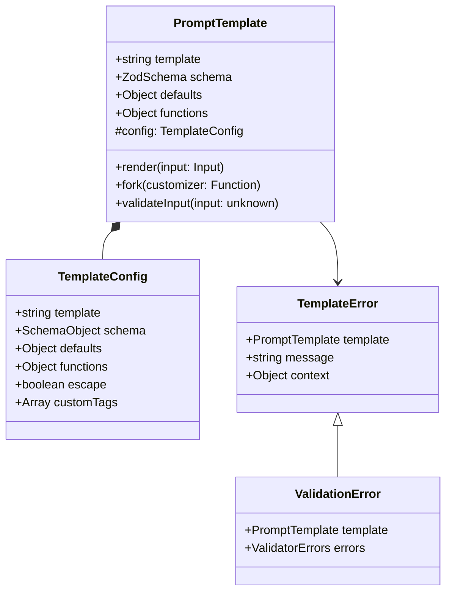

# Template

The `PromptTemplate` class is the foundation of the Bee Framework's templating system, providing robust functionality for creating, validating, and rendering structured prompts. Built on top of Mustache.js, it adds type safety, schema validation, and advanced template manipulation capabilities.

## Overview

`PromptTemplate` serves as the core system for managing prompt templates throughout the framework. It enables the creation of type-safe, validated templates with support for complex data structures, custom functions, and advanced rendering capabilities.

## Architecture



## Core Properties

| Property    | Type        | Description                           |
| ----------- | ----------- | ------------------------------------- |
| `template`  | `string`    | Template string with placeholders     |
| `schema`    | `ZodSchema` | Validation schema for inputs          |
| `defaults`  | `Object`    | Default values for template variables |
| `functions` | `Object`    | Custom rendering functions            |

## Main Methods

### Public Methods

#### `render(input: TemplateInput): string`

Renders the template with provided input data.

```ts
import { PromptTemplate } from "bee-agent-framework/template";
import { z } from "zod";

const greetingTemplate = new PromptTemplate({
  template: "Hello {{name}}!",
  schema: z.object({
    name: z.string(),
  }),
});

const output = greetingTemplate.render({
  name: "Alice",
});

console.log(output); // Hello Alice!
```

_Source: [examples/templates/primitives.ts](/examples/templates/primitives.ts)_

#### Arrays

<!-- embedme examples/templates/arrays.ts -->

```ts
import { PromptTemplate } from "bee-agent-framework/template";
import { z } from "zod";

const template = new PromptTemplate({
  schema: z.object({
    colors: z.array(z.string()).min(1),
  }),
  template: `Colors: {{#trim}}{{#colors}}{{.}},{{/colors}}{{/trim}}`,
});

const output = template.render({
  colors: ["Green", "Yellow"],
});
console.log(output); // Colors: Green,Yellow
```

_Source: [examples/templates/arrays.ts](/examples/templates/arrays.ts)_

#### Objects

<!-- embedme examples/templates/objects.ts -->

```ts
import { PromptTemplate } from "bee-agent-framework/template";
import { z } from "zod";

const template = new PromptTemplate({
  template: `Expected Duration: {{expected}}ms; Retrieved: {{#responses}}{{duration}}ms {{/responses}}`,
  schema: z.object({
    expected: z.number(),
    responses: z.array(z.object({ duration: z.number() })),
  }),
  defaults: {
    expected: 5,
  },
});

const output = template.render({
  expected: undefined, // default value will be used
  responses: [{ duration: 3 }, { duration: 5 }, { duration: 6 }],
});
console.log(output); // Expected Duration: 5ms; Retrieved: 3ms 5ms 6ms
```

_Source: [examples/templates/objects.ts](/examples/templates/objects.ts)_

#### `fork(customizer: Function): PromptTemplate`

Creates a new template by modifying an existing one.

```ts
import { PromptTemplate } from "bee-agent-framework/template";
import { z } from "zod";

const original = new PromptTemplate({
  template: `You are a helpful assistant called {{name}}. Your objective is to {{objective}}.`,
  schema: z.object({
    name: z.string(),
    objective: z.string(),
  }),
});

const modified = original.fork((config) => ({
  ...config,
  template: `${config.template} Your answers must be concise`,
  defaults: {
    name: "Bee",
  },
}));

const output = modified.render({
  name: undefined, // default will be used
  objective: "fulfill the user needs",
});
console.log(output); // You are a helpful assistant called Bee. Your objective is to fulfill the user needs. Your answers must be concise.
```

_Source: [examples/templates/forking.ts](/examples/templates/forking.ts)_

## Template Features

### Schema Validation

```ts
const userTemplate = new PromptTemplate({
  template: "User: {{name}}, Age: {{age}}",
  schema: z.object({
    name: z.string().min(1),
    age: z.number().min(0).max(150),
  }),
});

// Throws ValidationPromptTemplateError if invalid
userTemplate.render({
  name: "John",
  age: 30,
});
```

### Default Values

```ts
const configTemplate = new PromptTemplate({
  template: "Server: {{host}}:{{port}}",
  schema: z.object({
    host: z.string(),
    port: z.number(),
  }),
  defaults: {
    host: "localhost",
    port: 8080,
  },
});
```

### Custom Functions

```ts
const messageTemplate = new PromptTemplate({
  schema: z.object({
    text: z.string(),
    timestamp: z.date(),
  }),
  functions: {
    formatDate() {
      return new Date(this.timestamp).toLocaleString();
    },
  },
  template: "{{text}} (Sent: {{formatDate}})",
});
```

## Implementation Examples

### Basic Template

```ts
const simpleTemplate = new PromptTemplate({
  template: "{{#trim}}{{#items}}{{.}},{{/items}}{{/trim}}",
  schema: z.object({
    items: z.array(z.string()),
  }),
});

console.log(
  simpleTemplate.render({
    items: ["one", "two", "three"],
  }),
); // "one,two,three"
```

### Complex Template

```ts
const profileTemplate = new PromptTemplate({
  template: `
    Name: {{name}}
    Age: {{age}}
    {{#hasHobbies}}
    Hobbies:
    {{#hobbies}}
    - {{name}} ({{years}} years)
    {{/hobbies}}
    {{/hasHobbies}}
  `,
  schema: z.object({
    name: z.string(),
    age: z.number(),
    hobbies: z.array(
      z.object({
        name: z.string(),
        years: z.number(),
      }),
    ),
  }),
  functions: {
    hasHobbies() {
      return this.hobbies.length > 0;
    },
  },
});
```

## Best Practices

1. **Schema Definition**

   ```ts
   // Define clear, specific schemas
   const schema = z.object({
     required: z.string(),
     optional: z.number().optional(),
     defaulted: z.string().default("value"),
   });
   ```

2. **Error Handling**

   ```ts
   try {
     template.render(input);
   } catch (error) {
     if (error instanceof ValidationPromptTemplateError) {
       console.error("Invalid input:", error.errors);
     }
   }
   ```

3. **Template Organization**

   ```ts
   // Create base templates for reuse
   const baseTemplate = new PromptTemplate({
     template: "{{content}}",
     schema: z.object({
       content: z.string(),
     }),
   });

   // Extend for specific uses
   const specializedTemplate = baseTemplate.fork((config) => ({
     ...config,
     template: `Special: ${config.template}`,
   }));
   ```

4. **Function Helpers**
   ```ts
   const template = new PromptTemplate({
     schema: messageSchema,
     functions: {
       formatDate() {
         return new Date(this.date).toLocaleString();
       },
       truncate(text: string) {
         return text.length > 100 ? `${text.slice(0, 97)}...` : text;
       },
     },
   });
   ```

## See Also

- [Agent System](./agent.md)
- [LLM System](./llms.md)
- [Error Handling](./errors.md)
- [Validation](./validation.md)
