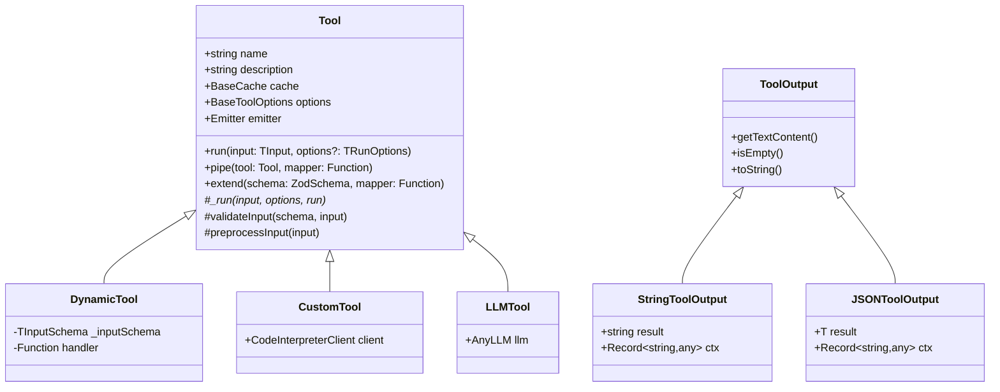

# Tools

The `Tool` class is the foundation of the Bee Framework's tool system, providing the core interface and functionality for creating specialized capabilities that agents can use to perform specific tasks. Tools extend an agent's abilities beyond pure language processing, enabling interactions with external systems, data processing, and task execution.

## Overview

`Tool` defines the standard interface and basic functionality that all tool implementations must follow. It handles input validation, execution flow, caching, error handling, and provides a consistent interface for different tool types like Python execution, web searches, database queries, and custom operations.

## Architecture



## Core Properties

| Property      | Type              | Description                                              |
| ------------- | ----------------- | -------------------------------------------------------- |
| `name`        | `string`          | Unique identifier for the tool                           |
| `description` | `string`          | Natural language description of tool's purpose           |
| `options`     | `BaseToolOptions` | Configuration options including retry and cache settings |
| `cache`       | `BaseCache`       | Cache system for tool outputs                            |
| `emitter`     | `Emitter`         | Event system for monitoring tool execution               |

## Main Methods

### Public Methods

#### `run(input: TInput, options?: TRunOptions): Promise<TOutput>`

Executes the tool with the given input and options.

```ts
const tool = new WikipediaTool();
const result = await tool.run({
  query: "Neural networks",
  limit: 5,
});
console.log(result.getTextContent());
```

#### `pipe(tool: Tool, mapper: Function): DynamicTool`

Creates a new tool that chains the output of the current tool to another tool.

```ts
const searchAndSummarize = wikipediaTool.pipe(llmTool, (input, output) => ({
  input: `Summarize this article: ${output.getTextContent()}`,
}));
```

#### `extend(schema: ZodSchema, mapper: Function): DynamicTool`

Creates a new tool with modified input schema while reusing the original tool's functionality.

```ts
const enhancedSearch = wikipediaTool.extend(
  z.object({
    topic: z.string(),
    language: z.string().default("en"),
  }),
  (input) => ({
    query: input.topic,
    lang: input.language,
  }),
);
```

## Built-in Tools

| Tool               | Description              | Input Schema                            |
| ------------------ | ------------------------ | --------------------------------------- |
| `PythonTool`       | Executes Python code     | `{ code: string }`                      |
| `WikipediaTool`    | Searches Wikipedia       | `{ query: string, limit?: number }`     |
| `GoogleSearchTool` | Performs Google searches | `{ query: string, limit?: number }`     |
| `SQLTool`          | Executes SQL queries     | `{ query: string, params?: any[] }`     |
| `LLMTool`          | Processes text with LLMs | `{ input: string }`                     |
| `ArXivTool`        | Searches academic papers | `{ query: string, limit?: number }`     |
| `WebCrawlerTool`   | Fetches web content      | `{ url: string }`                       |
| `OpenMeteoTool`    | Gets weather data        | `{ location: Location, date?: string }` |

## Tool Implementations

### Standard Tool

<!-- embedme examples/tools/custom/base.ts -->

```ts
import {
  StringToolOutput,
  Tool,
  ToolInput,
  ToolInputValidationError,
} from "bee-agent-framework/tools/base";
import { z } from "zod";
import { randomInteger } from "remeda";

export class RiddleTool extends Tool<StringToolOutput> {
  name = "Riddle";
  description = "It generates a random puzzle to test your knowledge.";

  inputSchema() {
    return z.object({
      index: z
        .number()
        .int()
        .min(0)
        .max(RiddleTool.data.length - 1)
        .optional(),
    });
  }

  public static data = [
    "What has hands but can’t clap?",
    "What has a face and two hands but no arms or legs?",
    "What gets wetter the more it dries?",
    "What has to be broken before you can use it?",
    "What has a head, a tail, but no body?",
    "The more you take, the more you leave behind. What am I?",
    "What goes up but never comes down?",
  ];

  static {
    // Makes the class serializable
    this.register();
  }

  protected async _run(input: ToolInput<this>): Promise<StringToolOutput> {
    const index = input.index ?? randomInteger(0, RiddleTool.data.length - 1);
    const riddle = RiddleTool.data[index];
    if (!riddle) {
      throw new ToolInputValidationError(`Riddle with such index (${index}) does not exist!`);
    }
    return new StringToolOutput(riddle);
  }
}
```

_Source: [examples/tools/custom/base.ts](/examples/tools/custom/base.ts)_

Using the `DynamicTool` class

The `DynamicTool` allows you to create a tool without extending the base tool class.

<!-- embedme examples/tools/custom/dynamic.ts -->

```ts
import { DynamicTool, StringToolOutput } from "bee-agent-framework/tools/base";
import { z } from "zod";

const tool = new DynamicTool({
  name: "GenerateRandomNumber",
  description: "Generates a random number in the given interval.",
  inputSchema: z.object({
    min: z.number().int().min(0),
    max: z.number().int(),
  }),
  async handler(input) {
    const min = Math.min(input.min, input.max);
    const max = Math.max(input.max, input.min);

    const number = Math.floor(Math.random() * (max - min + 1)) + min;
    return new StringToolOutput(number.toString());
  },
});
```

_Source: [examples/tools/custom/dynamic.ts](/examples/tools/custom/dynamic.ts)_

The `name` of the tool is required and must only contain characters between
a-z, A-Z, 0-9, or one of - or \_.
The `inputSchema` and `description` are also both required.

### Using the `CustomTool` (Python functions)

If you want to use the Python function, use the [`CustomTool`](/src/tools/custom.ts).

<!-- embedme examples/tools/custom/python.ts -->

```ts
import "dotenv/config";
import { CustomTool } from "bee-agent-framework/tools/custom";

const customTool = await CustomTool.fromSourceCode(
  {
    // Ensure the env exists
    url: process.env.CODE_INTERPRETER_URL!,
  },
  `import requests
from typing import Optional, Union, Dict

def get_riddle() -> Optional[Dict[str, str]]:
  """
  Fetches a random riddle from the Riddles API.

  This function retrieves a random riddle and its answer. It does not accept any input parameters.

  Returns:
      Optional[Dict[str, str]]: A dictionary containing:
          - 'riddle' (str): The riddle question.
          - 'answer' (str): The answer to the riddle.
      Returns None if the request fails.
  """
  url = 'https://riddles-api.vercel.app/random'
  
  try:
      response = requests.get(url)
      response.raise_for_status() 
      return response.json() 
  except Exception as e:
      return None`,
);
```

_Source: [examples/tools/custom/python.ts](/examples/tools/custom/python.ts)_

> [!IMPORTANT]
>
> Custom tools are executed within the code interpreter, but they cannot access any files.
> Only `PythonTool` does.

## Best Practices

1. **Error Handling**

   ```ts
   try {
     const result = await tool.run(input);
   } catch (error) {
     if (error instanceof ToolInputValidationError) {
       // Handle invalid input
     } else if (error instanceof ToolError) {
       // Handle tool execution errors
     }
   }
   ```

2. **Caching Strategy**

   ```ts
   const tool = new SearchTool({
     cache: new UnconstrainedCache(),
     retryOptions: {
       maxRetries: 3,
       factor: 2,
     },
   });
   ```

3. **Event Monitoring**

   ```ts
   tool.emitter.on("start", ({ input }) => {
     console.log("Tool execution started:", input);
   });

   tool.emitter.on("success", ({ output }) => {
     console.log("Tool execution succeeded:", output);
   });
   ```

## General Tips

### Data Minimization

If your tool is providing data to the agent, try to ensure that the data is relevant and free of extraneous metatdata. Preprocessing data to improve relevance and minimize unnecessary data conserves agent memory, improving overall performance.

### Provide Hints

If your tool encounters an error that is fixable, you can return a hint to the agent; the agent will try to reuse the tool in the context of the hint. This can improve the agent's ability to recover from errors.

### Security & Stability

When building tools, consider that the tool is being invoked by a somewhat unpredictable third party (the agent). You should ensure that sufficient guardrails are in place to prevent adverse outcomes.

1. **Input Sanitization**: Always validate and sanitize inputs before processing
2. **Resource Limits**: Implement timeouts and resource constraints
3. **Access Control**: Restrict tool capabilities based on context
4. **Error Messages**: Avoid exposing sensitive information in errors
5. **Rate Limiting**: Implement rate limiting for external service calls

## See Also

- [Agent Documentation](./agent.md)
- [Memory System](./memory.md)
- [LLM Integration](./llms.md)
- [Cache System](./cache.md)
