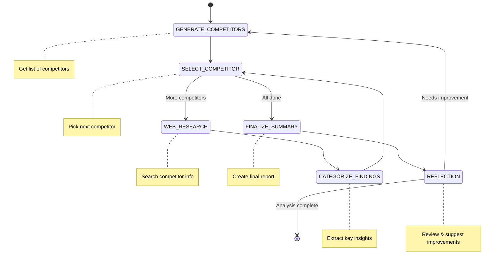

# Competitive Analysis Workflow

A workflow built with the BeeAI Framework that automates competitor research and generates market analysis reports. It helps identify competitors, gather data, analyze findings, and create detailed summaries.

## Workflow Overview

This workflow helps streamline competitive research by:
1. Identifying Competitors: Automatically generates a list of competitors in a given industry or from a custom list you provide.
2. Selecting Competitors for Analysis: Chooses which competitor to analyze next from the list.
3. Conducting Web Research: Uses the Tavily API to gather relevant data about each competitor.
4. Categorizing Findings: Analyzes the data and categorizes the key insights.
5. Generating a Final Report: Compiles all findings into a markdown-based summary.
6. Reflection: Reflects on the final report and reruns workflow up to 3 times to make improvements.



## How to Use

1. Clone the Repository
```
git clone https://github.com/jenna-winkler/beeAI-competitive-analysis-workflow`
cd competitive-analysis-workflow
```
2. Install Dependencies
```
npm install
```
4. Set Up Environment Variables
```
# Copy the example environment file
cp .env.example .env

# Edit the .env file and add your Tavily API key
# Get your API key from https://tavily.com
TAVILY_API_KEY=your-api-key-here
```
4. Run the Workflow with a direct JSON input
```
# Analyze a specific industry
npm start <<< '{"industry": "Electric Vehicles"}'

# Analyze specific competitors
npm start <<< '{"industry": "Open Source AI Agent Frameworks", "specifiedCompetitors": ["CrewAI", "Relevance AI", "LangGraph", "AutoGen", "OpenAI"]}'
```

5. It will then run through the workflow steps, providing logs and insights along the way.

6. Upon completion, it will output the final competitive analysis.
   
Example Output

```markdown
=== Final Analysis ===

# Competitive Analysis: Open Source AI Agent Frameworks

Competitive analysis of CrewAI, Relevance AI, LangGraph, AutoGen, OpenAI

## CrewAI
* CrewAI is an open-source framework for managing AI agents, offering task automation and multi-agent collaboration.
* It provides tools to streamline workflows and enhance agent efficiency.
* Open-source framework allowing developers to build and manage AI agents with ease.
* Portkey Observability for comprehensive monitoring and optimization of AI agents.
* Role-based orchestration enabling agents to assume distinct roles in collaborative tasks.

## Relevance AI
* Relevance AI is a no-code platform for building custom AI agents.
* It offers low-code environment for creating automation workflows.
* The platform supports various business functions like sales and BDR activities.
* Customizable AI Agents with unique names, avatars, and descriptions.
* Low-code environment for easy deployment of AI solutions.
* Seamless integration with existing tools and workflows.

## LangGraph
* LangGraph provides a graph-based framework for building AI agents, enabling complex workflows and state management.
* It supports seamless integration of human input and external tools/APIs.
* Graph-based architecture allowing sophisticated stateful agents
* Built-in support for cyclic workflows and persistence
* Memory management capabilities for maintaining context over interactions
* Integration with various LLM models and external tools

## AutoGen
* AutoGen is a multi-agent AI development framework that supports collaboration among multiple AI models and tools.
* It offers advanced capabilities for building complex workflows through agent interactions.
* Multi-agent collaboration
* LLM integration
* Human-in-the-loop functionality
* Customizable interaction patterns

## OpenAI
* OpenAI is a leader in AI development with strong capabilities in NLP and generative models.
* Their platform offers comprehensive tools for text generation, knowledge integration, and API access.
* Generative Pretrained Transformer (GPT) models like ChatGPT that enable advanced natural language processing.
* File Search tools for integrating external knowledge into AI applications.

### Sources
* Unlocking the Power of AI with CrewAI: A Comprehensive Overview : https://www.squareshift.co/post/unlocking-the-power-of-ai-with-crewai-a-comprehensive-overview
* CrewAI: Unlocking Collaborative Intelligence in AI Systems : https://insights.codegpt.co/crewai-guide
* Portkey Observability and Guardrails - CrewAI : https://docs.crewai.com/how-to/portkey-observability
* Relevance AI: Platform for building custom AI agents to automate ... : https://aiforeasylife.com/tool/relevance-ai/
* How to Use Relevance AI: A Comprehensive Guide : https://aipure.ai/articles/how-to-use-relevance-ai-a-comprehensive-guide
* Relevance AI Review 2025: Use Cases, Pricing, and Low-Code Automation ... : https://techspherezone.com/relevance-ai-review-2025-use-cases-pricing-and-low-code-automation-insights/
* LangGraph Tutorial: A Comprehensive Guide to Building Advanced AI ... : https://dev.to/aragorn_talks/langgraph-tutorial-a-comprehensive-guide-to-building-advanced-ai-agents-l31
* LangGraph Tutorial: A Comprehensive Guide for Beginners : https://blog.futuresmart.ai/langgraph-tutorial-for-beginners
* Advanced Features of LangGraph: Summary and Considerations : https://dev.to/jamesli/advanced-features-of-langgraph-summary-and-considerations-3m1e
* Autogen Overview, Examples, Pros and Cons in 2025 : https://best-of-web.builder.io/library/microsoft/autogen
* What is AutoGen? Our Full Guide to the Autogen Multi-Agent Platform : https://skimai.com/what-is-autogen-our-full-guide-to-the-autogen-multi-agent-platform/
* AutoGen AI Agent Frameworks Reviews 2025: Features, Pricing, Pros, Cons ... : https://www.aitoolsty.com/tool/autogen
* Openai platform overview - Restackio : https://www.restack.io/p/openai-platform-overview
* OpenAI: A comprehensive overview and guide - Educative : https://www.educative.io/answers/openai-a-comprehensive-overview-and-guide
* Everything You Need to Know about OpenAI - analyticsdrift.com : https://analyticsdrift.com/everything-you-need-to-know-about-openai/
```