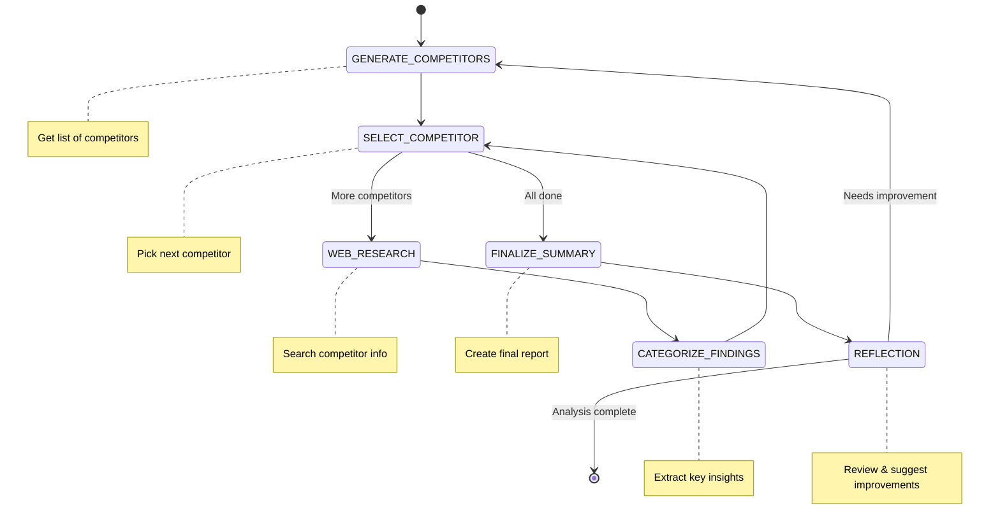

# Competitive Analysis Workflow

A workflow built with the BeeAI Framework that automates competitor research and generates market analysis reports. It helps identify competitors, gather data, analyze findings, and create detailed summaries.

## Workflow Overview

This workflow helps streamline competitive research by:

1. Identifying Competitors: Automatically generates a list of competitors in a given industry or from a custom list you provide.
2. Selecting Competitors for Analysis: Chooses which competitor to analyze next from the list.
3. Conducting Web Research: Uses the Tavily API to gather relevant data about each competitor.
4. Categorizing Findings: Analyzes the data and categorizes the key insights.
5. Generating a Final Report: Compiles all findings into a markdown-based summary.
6. Reflection: Reflects on the final report and reruns workflow up to 3 times to make improvements.



## How to Use

1. Project setup

Please follow these instructions common for all examples [Usage](../../README.md#usage)

2. Set Up Environment Variables

Provide TAVILY API key (Get your API key from https://tavily.com)

```dotenv
## Third-party services
TAVILY_API_KEY=your-api-key-here
```

4. Run the Workflow with a direct JSON input

```shell
# Analyze a specific industry
yarn start examples/workflows/competitive-analysis/main.ts <<< '{"industry": "Electric Vehicles"}'

# Analyze specific competitors
yarn start examples/workflows/competitive-analysis/main.ts <<< '{"industry": "Open Source AI Agent Frameworks", "specifiedCompetitors": ["CrewAI", "Relevance AI", "LangGraph", "AutoGen", "OpenAI"]}'
```

5. It will then run through the workflow steps, providing logs and insights along the way.

6. Upon completion, it will output the final competitive analysis.

Example Output

```markdown
=== Final Analysis ===

# Competitive Analysis: Open Source AI Agent Frameworks

Competitive analysis of CrewAI, Relevance AI, LangGraph, AutoGen, OpenAI

## CrewAI

- CrewAI is an open-source framework for managing AI agents, enabling collaboration and automation.
- It offers task automation and role-based orchestration, which are key differentiators.
- Open-source framework allowing collaboration among multiple AI agents.
- Task automation with role-based orchestration.
- Portkey observability for monitoring and optimization of agent performance.

## Relevance AI

- Relevance AI is a no-code platform for building and deploying AI agents and automation workflows.
- It offers tools like Gait and Cart.ai for collaboration and business automation.
- The platform emphasizes ease of use with its no-code interface.
- No-code platform for creating AI agents and automation workflows
- Gait: AI-assisted code generation with version control
- Cart.ai: Comprehensive business automation services including coding, CRM, video editing, e-commerce setup, and custom AI development

## LangGraph

- LangGraph provides a comprehensive framework for building advanced AI agents with built-in state management and memory systems.
- The platform offers robust integration options, including human feedback and persistence capabilities.
- Stateful AI agents capable of maintaining context over multiple interactions.
- Built-in memory management to handle complex workflows and persistent data storage.
- Seamless integration with human input for enhanced decision-making.
- Graph-based architecture enabling sophisticated workflow design and cyclic processes.

## AutoGen

- AutoGen is a multi-agent framework designed for building complex AI applications.
- It supports collaboration between multiple agents, enabling collaborative problem-solving.
- The platform provides human-in-the-loop capabilities, allowing for human feedback and oversight.
- Multi-agent collaboration and synergy
- Human-in-the-loop integration
- Support for large language models (LLMs)
- Customizable workflows and task orchestration

## OpenAI

- OpenAI offers access to advanced language models like GPT-4 and GPT-4 Turbo.
- The OpenAI API provides seamless integration for various AI tasks such as text generation, code completion, and image generation.
- Advanced language models with high capabilities in text generation and understanding.
- Seamless API integration enabling quick deployment of AI features across applications.

### Sources

- Unlocking the Power of AI with CrewAI: A Comprehensive Overview : https://www.squareshift.co/post/unlocking-the-power-of-ai-with-crewai-a-comprehensive-overview
- CrewAI: Unlocking Collaborative Intelligence in AI Systems : https://insights.codegpt.co/crewai-guide
- Portkey Observability and Guardrails - CrewAI : https://docs.crewai.com/how-to/portkey-observability
- Relevance AI Overview, Key Features, Use Cases and Alternatives : https://rushtechhub.com/ai-tool/relevance-ai/
- Relevance AI Features, Pros, Cons, and Use Cases : https://aipure.ai/products/relevance-ai/features
- How to Use Relevance AI: A Comprehensive Guide : https://aipure.ai/articles/how-to-use-relevance-ai-a-comprehensive-guide
- LangGraph Tutorial: A Comprehensive Guide to Building Advanced AI ... : https://dev.to/aragorn_talks/langgraph-tutorial-a-comprehensive-guide-to-building-advanced-ai-agents-l31
- Concepts - GitHub Pages : https://langchain-ai.github.io/langgraph/concepts/
- Building Autonomous AI Agents with LangGraph - Coursera : https://www.coursera.org/learn/packt-building-autonomous-ai-agents-with-langgraph-oyjym
- What is AutoGen? Our Full Guide to the Autogen Multi-Agent Platform : https://skimai.com/what-is-autogen-our-full-guide-to-the-autogen-multi-agent-platform/
- A Developer's Guide to the AutoGen AI Agent Framework : https://startupnews.fyi/2025/01/07/a-developers-guide-to-the-autogen-ai-agent-framework/
- Autogen Overview, Examples, Pros and Cons in 2025 : https://best-of-web.builder.io/library/microsoft/autogen
- Openai platform overview - Restackio : https://www.restack.io/p/openai-platform-overview
- OpenAI: A comprehensive overview and guide - Educative : https://www.educative.io/answers/openai-a-comprehensive-overview-and-guide
- A Complete Guide to the OpenAI API | Updated for 2024-25 : https://thirdeyedata.ai/a-complete-guide-to-the-openai-api-step-by-step-guide-for-2024-25/
- Unlocking the Power of AI with CrewAI: A Comprehensive Overview : https://www.squareshift.co/post/unlocking-the-power-of-ai-with-crewai-a-comprehensive-overview
- CrewAI: Unlocking Collaborative Intelligence in AI Systems : https://insights.codegpt.co/crewai-guide
- Portkey Observability and Guardrails - CrewAI : https://docs.crewai.com/how-to/portkey-observability
- Relevance AI Overview, Key Features, Use Cases and Alternatives : https://rushtechhub.com/ai-tool/relevance-ai/
- Relevance AI Features, Pros, Cons, and Use Cases : https://aipure.ai/products/relevance-ai/features
- How to Use Relevance AI: A Comprehensive Guide : https://aipure.ai/articles/how-to-use-relevance-ai-a-comprehensive-guide
- LangGraph Tutorial: A Comprehensive Guide to Building Advanced AI ... : https://dev.to/aragorn_talks/langgraph-tutorial-a-comprehensive-guide-to-building-advanced-ai-agents-l31
- Concepts - GitHub Pages : https://langchain-ai.github.io/langgraph/concepts/
- Building Autonomous AI Agents with LangGraph - Coursera : https://www.coursera.org/learn/packt-building-autonomous-ai-agents-with-langgraph-oyjym
- What is AutoGen? Our Full Guide to the Autogen Multi-Agent Platform : https://skimai.com/what-is-autogen-our-full-guide-to-the-autogen-multi-agent-platform/
- A Developer's Guide to the AutoGen AI Agent Framework : https://startupnews.fyi/2025/01/07/a-developers-guide-to-the-autogen-ai-agent-framework/
- Autogen Overview, Examples, Pros and Cons in 2025 : https://best-of-web.builder.io/library/microsoft/autogen
- Openai platform overview - Restackio : https://www.restack.io/p/openai-platform-overview
- OpenAI: A comprehensive overview and guide - Educative : https://www.educative.io/answers/openai-a-comprehensive-overview-and-guide
- A Complete Guide to the OpenAI API | Updated for 2024-25 : https://thirdeyedata.ai/a-complete-guide-to-the-openai-api-step-by-step-guide-for-2024-25/
- Unlocking the Power of AI with CrewAI: A Comprehensive Overview : https://www.squareshift.co/post/unlocking-the-power-of-ai-with-crewai-a-comprehensive-overview
- CrewAI: Unlocking Collaborative Intelligence in AI Systems : https://insights.codegpt.co/crewai-guide
- Portkey Observability and Guardrails - CrewAI : https://docs.crewai.com/how-to/portkey-observability
- Relevance AI Overview, Key Features, Use Cases and Alternatives : https://rushtechhub.com/ai-tool/relevance-ai/
- Relevance AI Features, Pros, Cons, and Use Cases : https://aipure.ai/products/relevance-ai/features
- How to Use Relevance AI: A Comprehensive Guide : https://aipure.ai/articles/how-to-use-relevance-ai-a-comprehensive-guide
- LangGraph Tutorial: A Comprehensive Guide to Building Advanced AI ... : https://dev.to/aragorn_talks/langgraph-tutorial-a-comprehensive-guide-to-building-advanced-ai-agents-l31
- Concepts - GitHub Pages : https://langchain-ai.github.io/langgraph/concepts/
- Building Autonomous AI Agents with LangGraph - Coursera : https://www.coursera.org/learn/packt-building-autonomous-ai-agents-with-langgraph-oyjym
- What is AutoGen? Our Full Guide to the Autogen Multi-Agent Platform : https://skimai.com/what-is-autogen-our-full-guide-to-the-autogen-multi-agent-platform/
- A Developer's Guide to the AutoGen AI Agent Framework : https://startupnews.fyi/2025/01/07/a-developers-guide-to-the-autogen-ai-agent-framework/
- Autogen Overview, Examples, Pros and Cons in 2025 : https://best-of-web.builder.io/library/microsoft/autogen
- Openai platform overview - Restackio : https://www.restack.io/p/openai-platform-overview
- OpenAI: A comprehensive overview and guide - Educative : https://www.educative.io/answers/openai-a-comprehensive-overview-and-guide
- A Complete Guide to the OpenAI API | Updated for 2024-25 : https://thirdeyedata.ai/a-complete-guide-to-the-openai-api-step-by-step-guide-for-2024-25/
- Unlocking the Power of AI with CrewAI: A Comprehensive Overview : https://www.squareshift.co/post/unlocking-the-power-of-ai-with-crewai-a-comprehensive-overview
- CrewAI: Unlocking Collaborative Intelligence in AI Systems : https://insights.codegpt.co/crewai-guide
- Portkey Observability and Guardrails - CrewAI : https://docs.crewai.com/how-to/portkey-observability
- Relevance AI Overview, Key Features, Use Cases and Alternatives : https://rushtechhub.com/ai-tool/relevance-ai/
- Relevance AI Features, Pros, Cons, and Use Cases : https://aipure.ai/products/relevance-ai/features
- How to Use Relevance AI: A Comprehensive Guide : https://aipure.ai/articles/how-to-use-relevance-ai-a-comprehensive-guide
- LangGraph Tutorial: A Comprehensive Guide to Building Advanced AI ... : https://dev.to/aragorn_talks/langgraph-tutorial-a-comprehensive-guide-to-building-advanced-ai-agents-l31
- Concepts - GitHub Pages : https://langchain-ai.github.io/langgraph/concepts/
- Building Autonomous AI Agents with LangGraph - Coursera : https://www.coursera.org/learn/packt-building-autonomous-ai-agents-with-langgraph-oyjym
- What is AutoGen? Our Full Guide to the Autogen Multi-Agent Platform : https://skimai.com/what-is-autogen-our-full-guide-to-the-autogen-multi-agent-platform/
- A Developer's Guide to the AutoGen AI Agent Framework : https://startupnews.fyi/2025/01/07/a-developers-guide-to-the-autogen-ai-agent-framework/
- Autogen Overview, Examples, Pros and Cons in 2025 : https://best-of-web.builder.io/library/microsoft/autogen
- Openai platform overview - Restackio : https://www.restack.io/p/openai-platform-overview
- OpenAI: A comprehensive overview and guide - Educative : https://www.educative.io/answers/openai-a-comprehensive-overview-and-guide
- A Complete Guide to the OpenAI API | Updated for 2024-25 : https://thirdeyedata.ai/a-complete-guide-to-the-openai-api-step-by-step-guide-for-2024-25/

## Reflection Notes

- The analysis lacks depth in comparing specific capabilities of each competitor.
- Key functionalities or features are missing from the critique, making it difficult to provide actionable insights.
- The sources and evidence used are not clearly cited, which undermines credibility.
- There is a lack of clarity in how each framework positions itself in the market.
- Enhance the analysis by including detailed comparisons of unique features across competitors.
- Ensure all key functionalities or features are identified and thoroughly discussed.
- Improve citation formatting to clearly reference sources and evidence.
- Clarify the market positioning of each framework, highlighting their unique selling points.
- Enhance the analysis by including detailed comparisons of unique features across competitors.
- Ensure all key functionalities or features are identified and thoroughly discussed.
- Improve citation formatting to clearly reference sources and evidence.
- Clarify the market positioning of each framework, highlighting their unique selling points.
```
